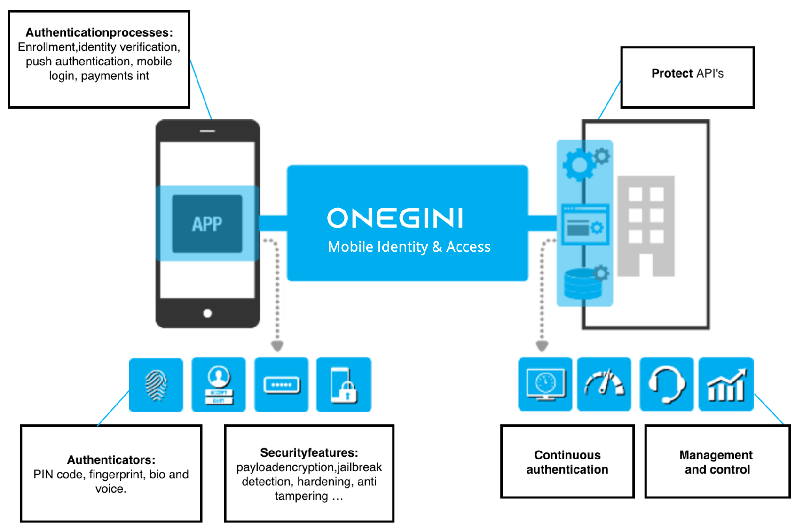

# Mobile Identity & Access

## Functional overview

The Mobile Identity & Access solution provides you with all the required features to secure your mobile apps. We can offer a branded Passwordless login app (via QR and push messages) to your customers and or employees. 

### Mobile security

Mobile security has been a complex and investment-heavy feature. Not to mention the constant maintenance and development work required to keep up with ever-evolving online security threats. OneWelcome Identity Cloud offers banking-grade mobile security without hassle.

On the left-hand side you see your mobile app where the OneWelcome Mobile Identity & Access solution provides options for Authentication processes like enrollment and strong customer authentication. Within these processes you can use a wide range of authenticators. We natively provide a PIN mechanism and seamless integration with biometric solutions like fingerprint and facial recognition authentication on mobile devices.

On the server side you'll manage and control all the rules and configuration like a pin policy, the applicable mobile OS versions your users have to use or which fallback mechanism between authenticators you allow. Out of the box you can configure a wide range of security features like:

- App integrity protection (tampering protection)
- Device integrity protection (jailbreak detection)
- Secure server communication (payload encryption)
- Secure user authentication

On the right-hand side you see the server side functionality where you provide the apps with data and monitor and control the flows and traffic. The OneWelcome Mobile Identity & Access solution uses OAuth 2.0 tokens to protect your APIs. This makes sure your customers have access to their resources. 

### Passwordless login 

Build on top of our Mobile security offering we offer a whitelabel authenticator app that your can use to offer a secure Passwordless Login experience for your customers and/or employees. The app is ready to go and requires low effort for both developers and the end users. OneWelcome's Passwordless Login is branded in your company's styling/colors. The user experience is very intuitive and fluent. In all flows of the app, the error handling is included in a user-friendly way. OneWelcome's Passwordless Login supports App2Web technology, enabling your users to continue their journey as a logged-in user in responsive web pages. 

Out-of-the-box supported flows:

- **REGISTRATION**: QR code scanning, Choose PIN and Biometrics
- **LOGIN TO APP** with PIN or Biometrics
- **AUTHENTICATION**: Mobile Login with QR, Push Message to confirm login on web
- **APP2WEB** support to guarantee Single Sign On access
- Support for **NOTIFICATIONS AND TRANSACTION APPROVAL**
- Over 40 screens with **SELF SERVICE FLOWS AND ERROR HANDLING**

You do not need any employees on your side for maintenance since OneWelcome will service our technology as a SaaS. Also, you don't have to worry about all Android and iOS updates, or the many new device updates as we will manage this for you.
