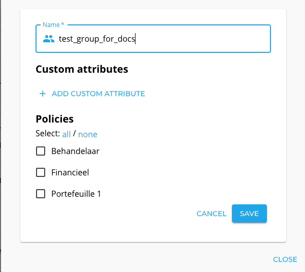
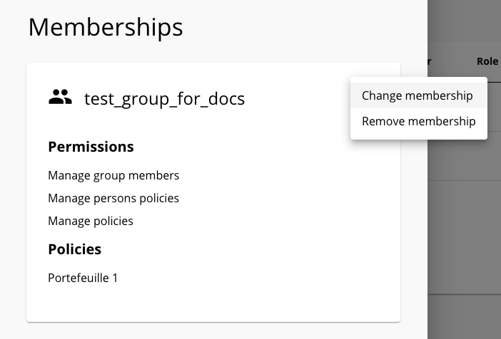

# In-depth view on resources

A `resource` represents the fine-grained access or privileges a user has outside Delegated Administration. For example, it can be a 
portfolio of, for instance, mortgages for a specific reseller when a resource is linked to a policy for mortgages. Each resource has a 
particular resource type.

We use the concept of a `resource type` to optionally link a resource to a policy. In those cases, only members or groups with that specific
policy assigned can be assigned to resources of that type.  If there is no policy connected to a resource type, these resources can be 
assigned to groups and members regardless of the policies configured in that group. There can be multiple resources of the same type.

A `privilege` represents what kind of actions a user can execute on a resource. The privileges are connected to a resource type to ensure 
that the same actions are available for all resources of the same type. For example, you can create a resource type with these three 
privileges: `read`, `create`, `update`. By default, the `No access` privilege is available for all resource types. While assigning a 
resource of that type to a user, you will have to specify which privilege the user has (you can only select one).

DABP does not use this information internally, it is the responsibility of the external system to verify that user has correct privileges 
on a resource when granting access to resource.

## Relation between groups, persons, policies and resources

Resources can be assigned both to a group and to a user. First, the resource needs to be assigned to a group. If the resources are not 
available for the group, you cannot assign them to members of that group. Secondly, if the resource type is connected to a policy, the 
policy also needs to be assigned to the member and the group. If that is the case, you can assign the resource together with a specific 
privilege to a member. This means that assigning resources to a person is a contextual operation. Let's take this scenario:

- There is resource type `Insurance` with list of privileges `read`, `write`. This type is linked with `Sell insurance` policy.
- There is resource type `Mortgage` with list of privileges `sell`, `extend`. This type is linked with `Sell mortgage` policy.
- There is resource type `Unrestricted` with list of privileges `read`, `write`. This type is not linked any policy.
- There is a resource `Life insurance portfolio` of type `Insurance`. 
- There is a resource `Mortgage portfolio` of type `Mortgage`. 
- There is a resource `Client contact infos` of type `Unrestricted`. 
- There are 3 groups `Organization Life`, `Organization Mortgage` and `Cooperation`.
- The policy `Sell insurance` is linked to the `Organization Life` and `Cooperation` groups. 
- The policy `Sell mortgage` is linked to the `Organization Mortgage` and `Cooperation` groups. 
- The resource `Life insurance portfolio` is linked to group `Organization Life` and `Cooperation`.
- The resource `Mortgage portfolio` is linked to group `Organization Mortgage` and `Cooperation`.
- The resource `Client contact info` is linked only to group `Cooperation`.
- A user `John Doe` is a member of all groups. 

| Groups                | `Life insurance portfolio` | `Mortgage portfolio` | `Client contact infos` |
| :-------------------- | :-------------------:  |:------------------: |:------------------: |
| **Cooperation**      |      ✅       |     ✅     | ✅     |
| **Organization Life** 	|      ✅       |     ❌     | ✅     |
| **Organization Mortgage** |      ❌      |      ✅     | ✅     |

This result in:

- The `Life insurace portfolio` cannot be added to `Organization Mortgage` group because `Sell insurance` policy is not linked to `Organization Mortgage` group.
- The `Mortgage portfolio` cannot be added to `Organization Life` group because `Sell mortgage` policy is not linked to `Organization Life` group.
- `Client contact info` can be added to any group as it has no policy restrictions.
- A superuser can assign the resource `Life insurance portfolio` with `read` or `write` privilege to John Doe in `Cooperation` and `Organization Life` if he has `Sell insurance` policy in those groups.
- A superuser can assign the resource `Mortgage portfolio` with `read` or `extend` privilege to John Doe in `Cooperation` and `Organization Mortgage` if he has `Sell mortgage` policy in those groups.
- A superuser can assign the resource `Client contact info` with `read` or `write` privilege to John Doe in all the groups regardless of the policies he has.

## The hierarchical relationship between groups, subgroups, and resources

It is not possible to assign more resources to a subgroup than its parent. This means that the DABP tool enforces that a superuser can only
assign resources to groups if the parent also has that resource. 

### Adding resource to a group

Adding a resource to a group does **not** assign this resource to all subgroups, it only makes it possible to assign this resource also to 
the subgroups. Also, Adding a resource to a group does **not** assign it to all the group members, it only makes it possible to assign the 
resource to the group members.

### Removing 

Removing a resource from a parent will result in the removal of the resource for all subgroups and members because the allowed resources 
are restricted by the resources assigned to the parent group. This means that members of the group and all subgroups will lose access to 
those resources.

## Assigning or removing resources to a group

To add/remove a resource to a group, you need the permission `Assign resources to groups`. If you have this permission, you should select 
the group you want to assign this resource to. After clicking on the desired group, a modal window with group information will appear.
Click on the vertical ellipsis button and select `Edit group`. Now you can select which resources can be assigned to the group.

After selecting the required resources click save to confirm your choice.

## Assigning or removing resources to a user

To manage users' resources, you need the permission `Assign resources to group members`. If you have this permission, open the user details 
modal, click the vertical ellipsis and choose "Change membership". This will switch the modal to the edit mode, where you will be able to 
change the user's resources. You can only assign resources also linked to the group in which you are editing a person.

When you click it, you can assign resources to a member in the group. Assigning resources requires to select a privilege. By default, the 
`No access` privilege is selected. Linking a user with a resource for one group does not mean he has access to the same resources in other 
groups linked to that resource. It's perfectly fine to link the user to `Life insurance portfolio` in group `Life products` and do not link
him with the same resource in another group. It is the responsibility of the external system to verify if a user has the required resources
for the required group. Click save to confirm your choices.

If you have the permission to `Assign resources to group members` you **can assign resources that are not assigned to you**.
