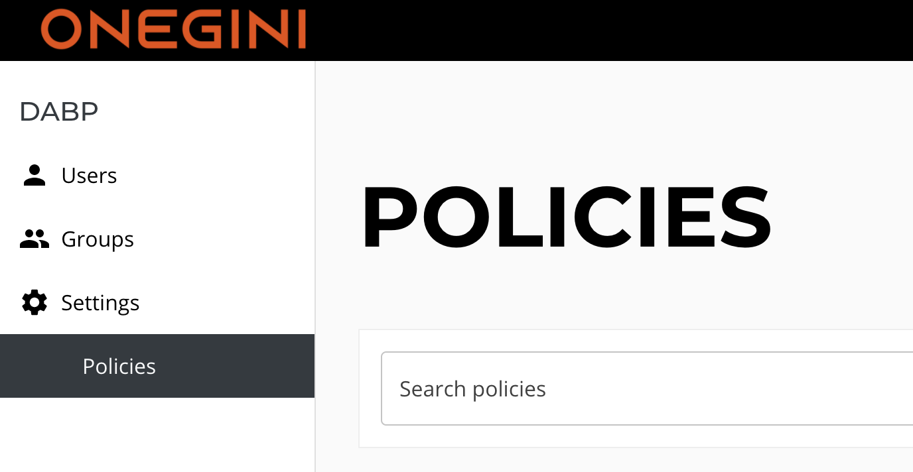

# Manage policies

A policy needs first to get created before it can get assigned to groups and members.
This can be done on the "Policies"   page. 

To manage policies, you must be an administrator with the `Add/edit/delete policies` permission on the root group. 
That is the top-level group 
The "Policies" page will be available under "Settings" when you have this permission.

## Create policies
*For technical documentation, see here [how to create a new policy via the API](../technical/create-policy-via-api.md).*

You can create a new policies using the "New Policy" button on the page. You have to give the policy a unique name.
New policies is automatically added to the root group.

## Edit policies
Policies can get edited by choosing the policy on the list. 
You can here click on the vertical ellipsis button and select "Edit policy".

Please note that users with the policy can lose access to applications when you change the policy.

## Delete policies 
Policies can get delete by clicking on the delete icon in the list of policies.
Alternatively, you can delete policies by selecting the policy and choose "Delete policy" under the vertical ellipsis menu.

Please note that the policy will be removed from all groups and members when a policy is deleted.
This might cause the users to lose access to applications. 
