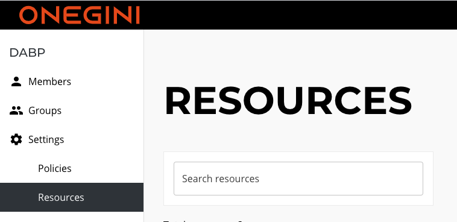

# Manage resources

You need to create a resource before you can assign it to groups and members.
Before you can create a resource, you must [Create resource types via API](../technical/create-resource-type-via-api.md)
Resources can be created on the "Resources" page or via the [Create Resource API](../technical/create-resource-via-api.md).

To manage resources, you must be an user with the `Add/edit/delete resources and resource types` permission on the root group.
That is the top-level group.
The "Resources" page is available under "Settings" when you have this permission.

## Create resources

*For technical documentation, see [How to create a new resource via the API](../technical/create-resource-via-api.md).*

You can create a new resource using the "New Resource" button on the page. You have to give the resource a unique name, specify an external
ID and select resource type.
A new resource is automatically added to the root group.
Thus a superuser with the permission `Assign resources to group members` on the root level can assign it to other groups.

## Edit resources

You can edit resources by clicking on resource on the resource overview.
You can then click on the vertical ellipsis button and select "Edit resource".
Only the resource name and external ID can be changed. If you need to change resource type, you need to create new resource with correct
type and delete the old one.

!!! note

    By editing a resource, users with that resource assigned might lose access to your applications when you change the resource.
    This only happens when you rely on the name and not the ID of a resource.

## Delete resources

You can delete resources by clicking on the delete icon in the list of resources.
Alternatively, you can delete resources by selecting the resource and choose "Delete resource" under the vertical ellipsis menu.

!!! warning

    The resource will be removed from all groups and members when it is deleted.
    This might cause the users to lose access to your applications. 
