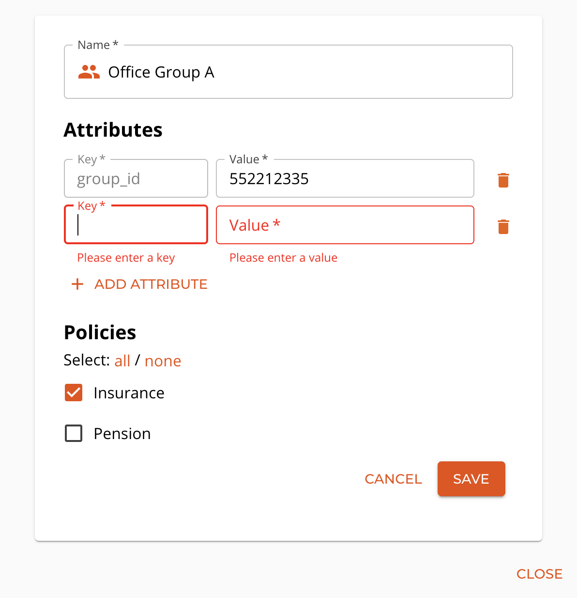

# How and when to use group attributes
When DABP is used in coordination with an external system to manage policies of users it might be beneficial to be able to add additional information to the group.
This can be achieved by group attributes.

## When to use attributes?
Attributes can be helpful in a wide range of scenarios.

Example:

1. Synchronization of group information with external systems - external system identifier can be stored as an attribute to allow mapping of the group to external data
2. Storing additional information about a group
    * when a group represents physical offices it can be addresses or contact information
    * any kind of metadata related to the group that is needed for external system or users of DABP
3. API exposes an endpoint that allows you to search for group with specified attribute.

## Adding attributes to group
Attributes can be added to the group from the Group Details dialog.
Use `+ Add custom attribtue` button to add a new attribute. You will need to specify a key (name) of the attribute and its value.

Click save to confirm your changes.
