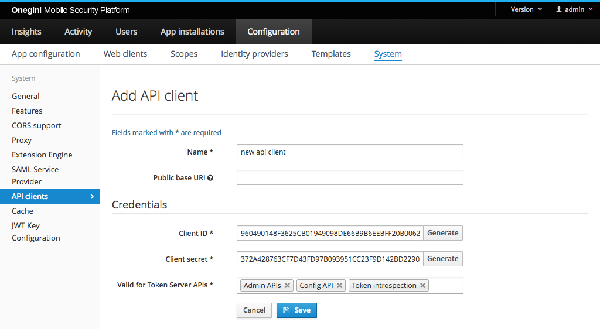

# API config

This section explains how administrators can manage access to [APIs within OneWelcome Access](../../api-reference/index.md).

## API clients

API clients are required to use their credentials to authorise access to APIs of OneWelcome Access. These credentials, as well as the APIs to which 
clients can get access to, can be configured within the following fields:

| Field                       | Required | Description                                                      |
|-----------------------------|----------|------------------------------------------------------------------|
| Name                        | yes      | Name of the API config. It's only used in the admin interface.   |
| Client ID                   | yes      | The identifier of the client during requests.                    |
| Client secret               | yes      | The secret of the client used during requests.                   |
| Valid for APIs              | yes      | APIs to which the client will have an access.                    |

## API scopes

The following API scopes are defined:

* onegini_api_admin
* onegini_api_config
* onegini_api_end_user
* onegini_api_events
* onegini_api_insights
* onegini_api_mobile_authentication
* onegini_api_payload_encryption_policy
* onegini_api_token_introspection
* onegini_api_user_registration
