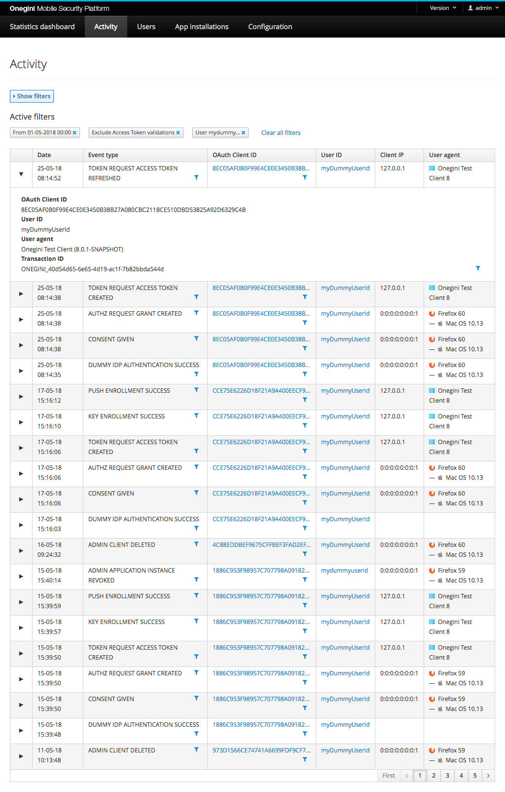

# Activity

This section shows an overview of the full audit log for Onegini Access. The most recent events are shown first.

The Activity section is available for users with the admin role or the operator role assigned. The events section provides access to events that are generated
by the Access engine as well as the admin console itself. An overview of event types is included in the [Access events](../access-events.md) section of
Onegini Access.

## Filter events

Events can be filtered on several properties. The values are case sensitive.

* Start and/or end date. Both days (dd-MM-yyyy) and date times (dd-MM-yyyy HH:mm) are allowed for this filter. Then no time is entered, it defaults to 00:00.
* Event Type: The different events that are triggered in the Access due to user action (e.g. consent given or access token issued).
* Exclude Access token introspections and validations: these events types appear in the audit log when the resource gateway validates an Access token from a
  client. Check this checkbox to exclude these common events from the results list.
* User ID: unique identifier of a user.
* OAuth Client ID: the client ID given to an OAuth client or application.
* Transaction ID: unique identifier of a transaction.

Most values are abbreviated to fit onto the screen. Hover over the value with the mouse to reveal more detailed information.

| Column name    | Description                                                                                                                                                                                                                                                                                                                                                                                                                                                                                                                                                                                                       |
|----------------|-------------------------------------------------------------------------------------------------------------------------------------------------------------------------------------------------------------------------------------------------------------------------------------------------------------------------------------------------------------------------------------------------------------------------------------------------------------------------------------------------------------------------------------------------------------------------------------------------------------------|
| Date           | The date and time of the event that was triggered.                                                                                                                                                                                                                                                                                                                                                                                                                                                                                                                                                                |
| Event          | The event type that was triggered. Event types are described in the [Access events](../access-events.md) section.                                                                                                                                                                                                                                                                                                                                                                                                                                                               |
| OAuth Client ID | The identifier of the OAuth client that triggered the event.                                                                                                                                                                                                                                                                                                                                                                                                                                                                                                                                                      |
| User ID        | The end user that triggered the event.                                                                                                                                                                                                                                                                                                                                                                                                                                                                                                                                                                            |
| Client IP      | The IP address of the client that triggered the event.                                                                                                                                                                                                                                                                                                                                                                                                                                                                                                                                                            |
| User Agent     | The software agent that is acting on behalf of the user. E.g. a specific internet browser version.                                                                                                                                                                                                                                                                                                                                                                                                                                                                                                                |
| Transaction ID | The name of the header that contains a transaction id. This transaction id will be included in the audit events and requests sent to external systems. When the specified header is not available in the request, a transaction id will be generated by the application prefixed with "ONEGINI-".   **
Note:**  The network gateway, for example WebSEAL, should strip the configured header name from any incoming request to prevent malicious input via this header. This header serves strictly the purpose of enabling a [SIEM solution](https://en.wikipedia.org/wiki/Security_information_and_event_management) to create a transactional view of the communication flow between systems. |
| Admin          | The admin console user that triggered the event                                                                                                                                                                                                                                                                                                                                                                                                                                                                                                                                                                   |
| Details        | Additional remarks about the event.                                                                                                                                                                                                                                                                                                                                                                                                                                                                                                                                                                               |

