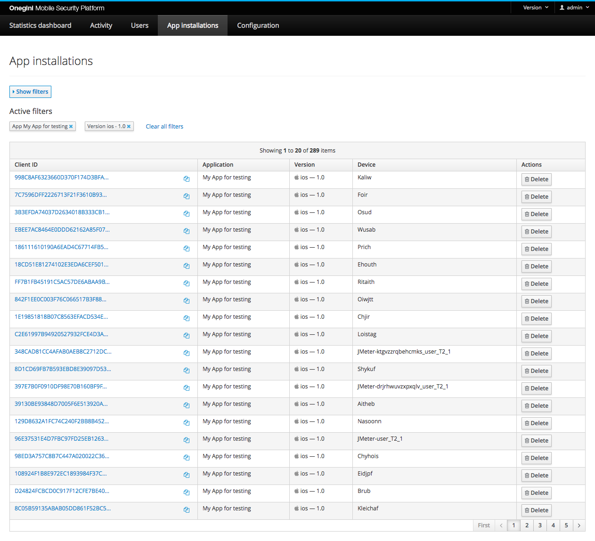

# OAuth Config

> **Note:** Most of the documentation for the OAuth config has moved to the relevant [Topic Guides](../../topics/index.md). This page describes the 
> sections that are not yet covered by a Topic Guide.

In this section the OAuth and OpenID Connect scopes, applications and clients are managed.

## Access control
Users with the role admin can change these settings. Users with the role operator can view, but not change.

> **Note: ** If identifiers can be manually entered, they are restricted to letters, numbers, underscore and hyphen characters.

## App installations

App installations are the activated instances of an Application on the device of an end user. Their configuration is managed by the Application, but individual 
instances can be removed to deny future access to the data of the end user.

The picture above shows a list of app installations.

### Filter App installations

You can apply the following filter to the list of App installations:
* Client ID: the unique identifier for this App installation.
* Application: this filter will show all App installations that share the configuration from this Application.
* Version: a specific platform (iOS, Android) and version for an Application. You must select an Application first to select a Version.

## Certificates

This section allows you to manage certificates used by mobile applications. Here you can create, modify or delete your certificates.
One certificate is defined by its name, expiration date and certificate file. 

The expected file format of a certificate is the PEM format with base64 armoring. 

Certificate files are added by uploading it to the Server. The maximum file size for a certificate is by default 65kB. 

When creating new certificate all 3 fields (`name`, `expiration date` and `certificate file`) are required.
When updating a certificate only `name` and `expiration date` are required, that way you can change the name without uploading the certificate file again.

### Getting the certificate file
You can use Firefox to export the certificate. Click on the lock of the SSL website. Choose: more information. 
In the security tab press View certificate. Then go to the details tab. And there you can choose which certificate in the chain you wish to export. When 
exporting, export in the PEM format.
