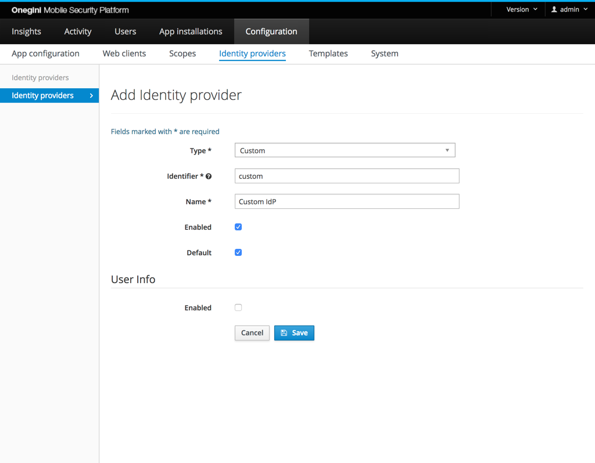
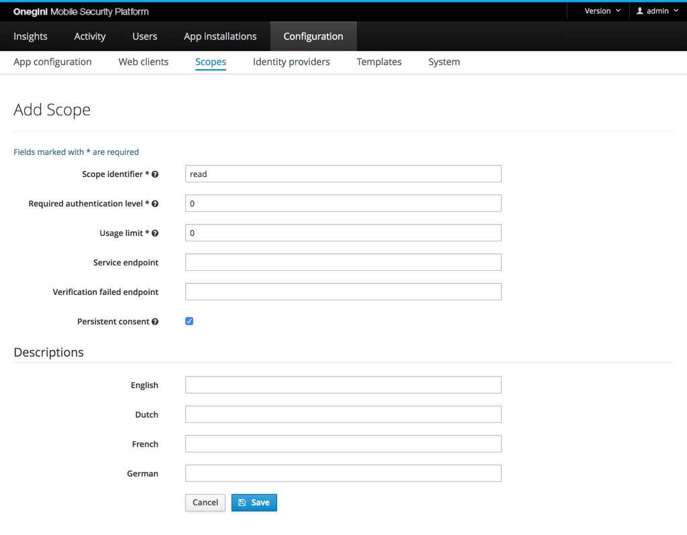
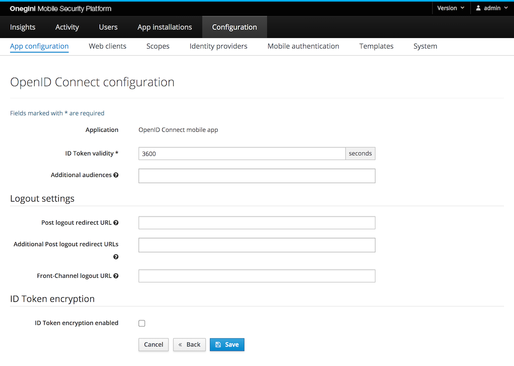
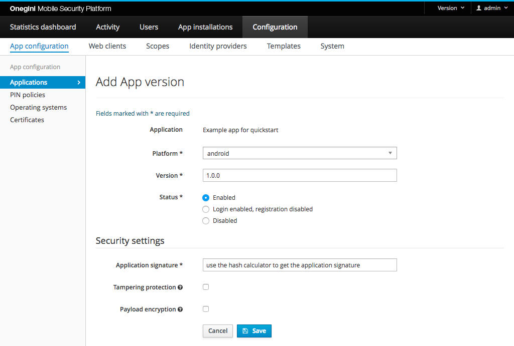

# Configuration setup example apps

This page describes the minimal setup to connect your mobile app to the Onegini Identity Cloud. Intended for
the [iOS example app](https://github.com/Onegini/ios-example-app) and [Android example app](https://github.com/Onegini/android-example-app). Please note that
the config below is *not a production setup*, just to get started developing.

## 1. Login on Onegini Access admin

Make sure your account has *administrator* access in Onegini Access admin UI.

## 2. Configure Identity provider

Under the Identity provider configuration (`admin/identity-provider-config`), we'll setup a *custom* IdP by clicking the Add button.

We use the Custom (Browser) type for testing purposes only. This IdP allows app users to register no matter what (`allow access grant`). We'll give it an
identifier and a name, so it can be referenced in the application config. Let's use `custom` for the identifier and `Custom IdP` as name. Furthermore, we'll set
this config as default and enable it.

See the section [identity providers](../../topics/general-app-config/identity-providers/identity-providers.md) for more information about this configuration.

## 3. Add read scope

Go to the Configuration section (`admin/oauth-config`) and click Scopes (`admin/oauth-config/scopes`). Click the Add button to add the read scope.

`read` will be the identifier. The required authentication level and usage limit are both 0. It does not matter whether Persistent consent is checked or
unchecked.

[See the section on scopes for more information.](../../topics/general-app-config/scopes/scopes.md)

## 4. Add application config

Now we'll add configuration specific to our new application: `ExampleApp`.

* Identifier is `ExampleApp`.
* Choose a name for the application, e.g. `Example app for quickstart`.
* Flows, choose: `User registration`.
* Redirect URL is `oneginiexample://loginsuccess`.
* Access grant validity: 30 seconds.
* Access token validity: 900 seconds (15 minutes).
* Resource gateway: leave empty.
* Default scopes: `read`.
* Additional scopes: leave empty.
* Primary Identity provider, select the `Custom IdP` that we have just created.
* Additional Identity providers: leave empty.
* PIN authentication: checked.
* Registration validity: leave empty.
* Fingerprint authentication: unchecked.
* Custom Authenticators enabled: unchecked if present in the form.
* Implicit Authentication: checked. If the checkbox is disabled, make sure you have applied the `User registration` flow.
* Max PIN attempts 3.
* PIN Policy: leave empty.
* Select the correct certificate(s) when using https for Onegini Access. Otherwise the app cannot connect to Onegini Access over https. Contact your sysadmin if
  you cannot select the correct certificate(s).
* Development mode: checked.
* Logo Url and Template set can be empty.
* Check `Skip Consent page` and `Skip Complete page`. You can upload [new certificates](../../appendix/administration/oauth-config.md#certificates)
  under: `admin/oauth-config/certificates`.

Refer to the section on [mobile application configuration](../../topics/mobile-apps/app-configuration/app-configuration.md) for more details.

### Configure OpenID Connect

After saving the application config, you'll see a screen to configure OpenID Connect. For the example app, you can use the default values.

### Add App version

In the list of App configurations, click on the App configuration that you have just created (`admin/oauth-config/applications/view/ExampleApp`). On this page
you can add an App version. You must do this for each new version of the app for each platform.

* Choose Platform `ios` or `android`
* Version `1.0.0`
* Status: `Enabled`
* Application signature: you can fill out `anything`, because we have checked `development mode` in the App configuration.
* Tampering protection, Payload encryption and Disabled: do not check.
* Push messaging configuration: leave it empty if present in the form.

[More information on app version config](../../topics/mobile-apps/app-configuration/app-version-management.md)

Now you should be able to test the configuration using the example app. Let us know if you have any troubles.