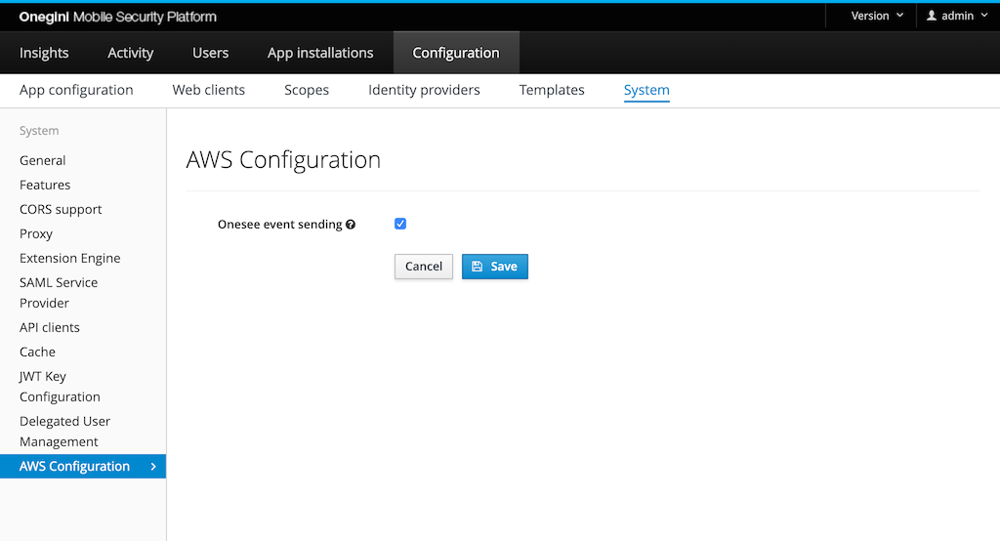

# OneSee events

Onegini Access gives possibility to export security events to the OneSee cloud platform. These events are then available to be fetched from an AWS S3 bucket.
The events are stored in [Common Event Format](https://ldapwiki.com/wiki/Common%20Event%20Format) (CEF).

## Configuration

The feature needs to be enabled in the `Configuration` → `System` → `AWS Configuration` section of the admin panel.

