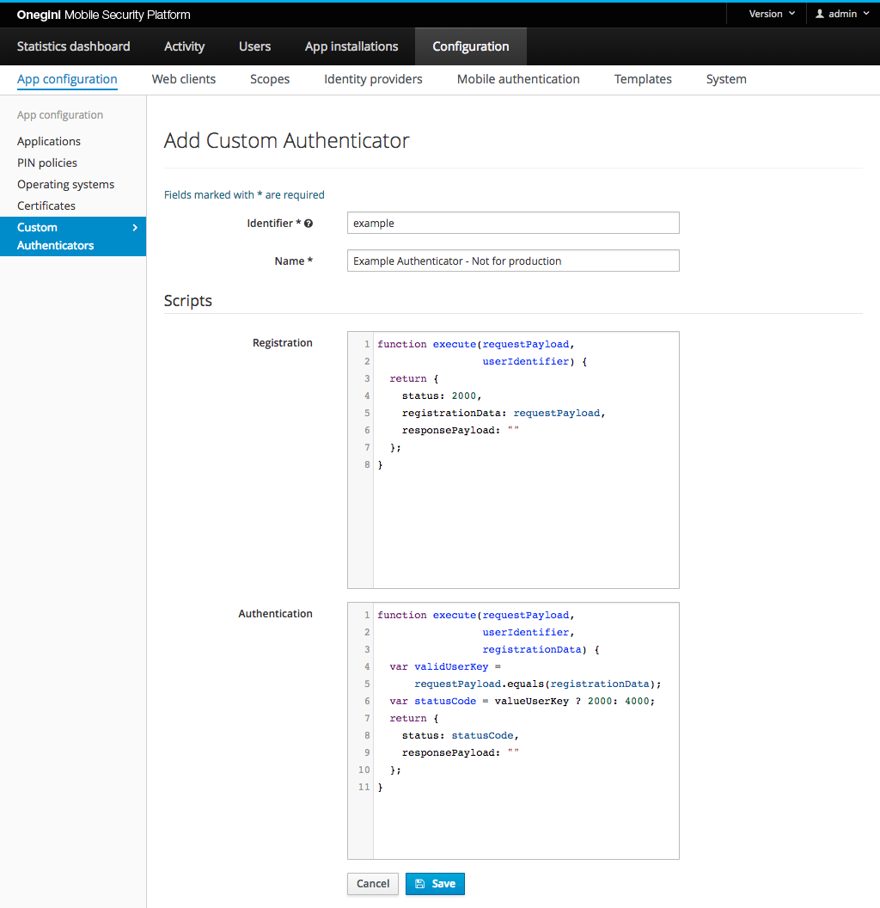

# General Custom Authenticators configuration

Custom Authenticators is an optional component of OneWelcome Access. If you want to use it, enable the `Custom Authenticators` option described on the [Configure system features](../technical-app-management/system-features-config/system-features-config.md) page.

## Create or edit a Custom Authenticator

Go to `Configuration` → `App configuration` → `Custom Authenticators` and add or edit a Custom Authenticator.

The picture below shows the page to configure the Custom Authenticator in the Admin Console.

| Field                   | Required | Example value                | Details
|-------------------------|----------|------------------------------|------------------------------------------------------------------------------------------------
| Identifier              | Yes      | voice_recognition            | Identifier for the Custom Authenticator 
| Name                    | Yes      | Authenticate with your voice | Human readable name for the Custom Authenticator

Enter the scripts for each step of the Custom Authentication flow in the fields under the section `Scripts`. See the [Custom Authenticator Example](custom-authenticator-example.md) page for examples of each step. The script fields are left optional because the scripts may not be available during the development stage.

## Application configuration

Custom Authenticators can be enabled per Application in OneWelcome Access. 

Go to `Configuration` → `App configuration` → `Applications` and add or edit an Application.

| Field                             | Required     | Example value       | Details
|-----------------------------------|--------------|---------------------|------------------------------------------------------------------------------------------------
| Custom authenticators enabled     | No           |                     | Enables / disables Custom Authenticators for this Application
| Custom authenticators             | When enabled |                     | Defines which authenticators are enabled for this Application

## Mobile authentication

To use mobile authentication via a Custom Authenticator. Configure a mobile authentication type like it is done for any other type. See the [topic guide for 
mobile authentication](../mobile-apps/mobile-authentication/mobile-authentication.md#configure-mobile-authentication-types). Select 
`Push with Custom Authenticator` as authentication method and fill out all other required fields.
