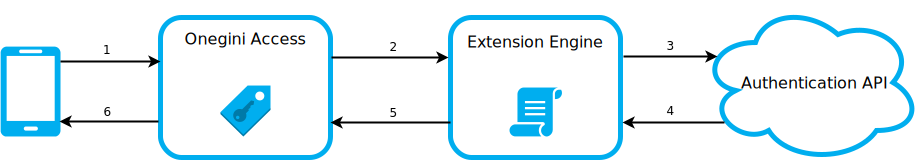

# Custom Authenticators

Onegini Access has standard support for authentication via PIN or Fingerprint. There are many other ways to authenticate a user, for example via NFC, voice or face recognition. These methods have their own APIs to authenticate. With the feature "Custom Authenticators" you can implement the logic to authenticate the user via scripts. These scripts are maintained via the Admin Console of Onegini Access.

## Flows

The general flow for authentication with a Custom Authenticator:

## Registration

Prerequisite: The user has authenticated via one of the standard authenticators. Then they can register for your Custom Authenticator.

1. Onegini SDK passes the user identifier and registration request data to Onegini Access.
2. Onegini Access validates the request. It passes the user identifier and registration request payload to the Onegini Extension Engine.
3. Registration script is executed. It can call an external API to register the user. This depends on your implementation.
4. API returns the result of the registration.
5. Registration script returns a status code that indicates whether the registration has succeeded. It can also return registration data and a response payload (optional).
6. Onegini Access saves the registration response data. It returns the optional response payload.

## Authentication

Prerequisite: The user has registered before with this Custom Authenticator.

1. Onegini SDK passes authentication request data to Onegini Access.
2. Onegini Access validates the request. It passes the user identifier, authentication request data and the saved registration response data to the Onegini Extension Engine.
3. Authentication script is executed. It can call an external API to authenticate the user. This depends on your implementation.
4. API returns the result of the authentication.
5. Authentication script returns a status code that indicates whether the authentication has succeeded. It can also return a response payload (optional).
6. Onegini Access returns an Access Token if the authentication is successful, otherwise an error. It also returns the optional response payload.

## Deregistration
Prerequisite: The user has registered before with this Custom Authenticator and is authenticated in the mobile app.

1. Onegini SDK passes the deregister request to Onegini Access.
2. Onegini Access validates the request. It removes the reference to the Custom Authenticator for this user.

If the user wants to use the Custom Authenticator in the future, they need to register again.

## More information
* [Configuration](custom-authenticators-configuration.md)
* [Example scripts](custom-authenticator-example.md)