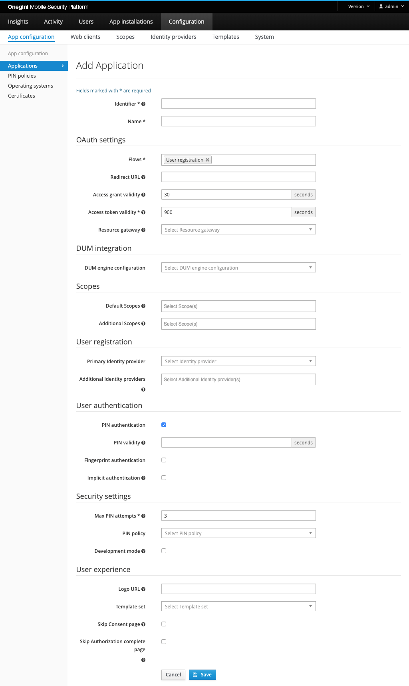
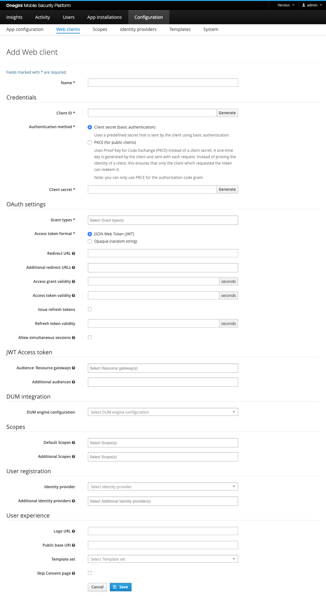

# Delegated Administration configuration

The steps below summarizes how to configure the [person reports](../../../../dabp/guides/technical/person-report.md) from Delegated Administration.

## Configure mobile application to use selected Delegated Administration configuration
New `Delegated Administration integration` section will appear in mobile application configuration if at least one DUM engine configuration is present.

See the [Creating a new application](../mobile-apps/app-configuration/app-configuration.md#creating-a-new-application)
 for more information about this configuration.

## Configure web client to use selected Delegated Administration configuration
New `Delegated Administration integration` section will appear in Web Client configuration if at least one DUM engine configuration is present.

See the [Creating a Web Client](../web-clients/web-client-configuration.md#creating-a-web-client) for more information about this configuration.

