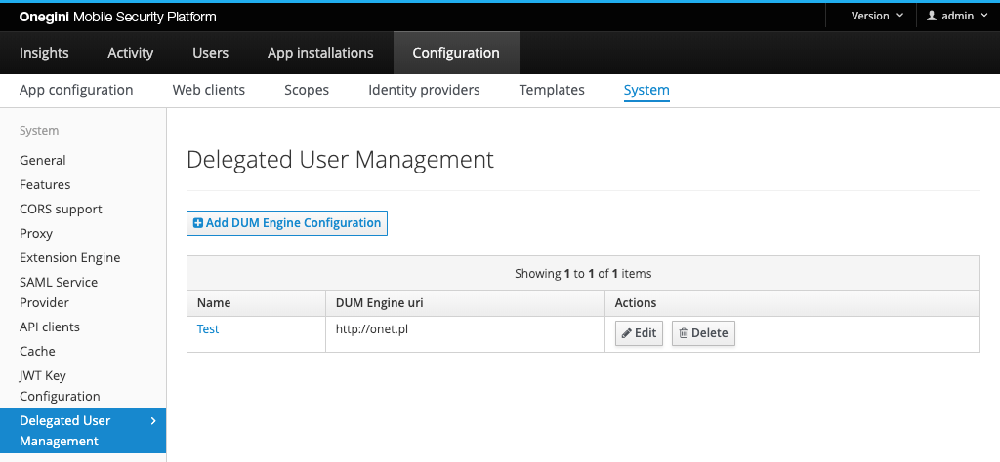

# Delegated Administration configuration

The steps below summarizes how to configure the [person reports](../../../../dabp/guides/person-report.md) from Delegated Administration.

## Creating Delegated Administration configuration
Onegini Access requires configuring the uri and credentials to access the Delegated Administration instance.

In order to create a new configuration, go to the `Configuration` section of the administration console, then `System` and click the `Delegated User Management` tab.
On the overview that is shown you can see all the existing Delegated Administration configurations.

To add a new configuration click on the add button. The following form will appear:

| Field                             | Required  | Example value                                                           | Details
|-----------------------------------|-----------|-------------------------------------------------------------------------|------------------------------------------------------------------------
| Name                              | Yes       | myDabpConfig                                                             | Descriptive name of the configuration
| Delegated Administration uri      | Yes       | https://dabp.example.com                                                 | URI to access Delegated Administration instance
| Username                          | Yes       | myLogin                                                                 | Username to login to Delegated Administration instance
| Password                          | Yes       | gsD53F#da#$s35                                                          | Password to login to Delegated Administration instance

Fill all the mandatory fields (marked with `*` on the form). The other fields are optional.

## Configure mobile application to use selected Delegated Administration configuration
New `Delegated Administration integration` section will appear in mobile application configuration if at least one DUM engine configuration is present.

See the [Creating a new application](../mobile-apps/app-configuration/app-configuration.md#creating-a-new-application)
 for more information about this configuration.

## Configure web client to use selected Delegated Administration configuration
New `Delegated Administration integration` section will appear in Web Client configuration if at least one DUM engine configuration is present.

See the [Creating a Web Client](../web-clients/web-client-configuration.md#creating-a-web-client) for more information about this configuration.

