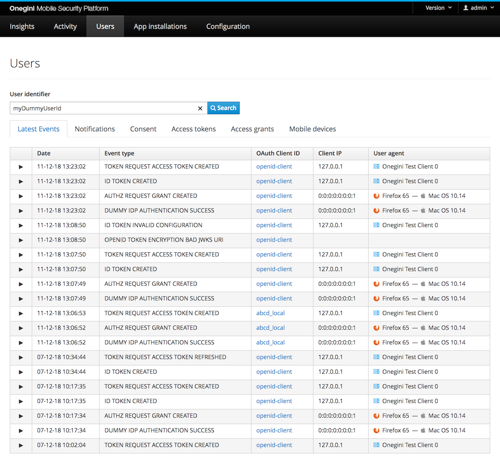
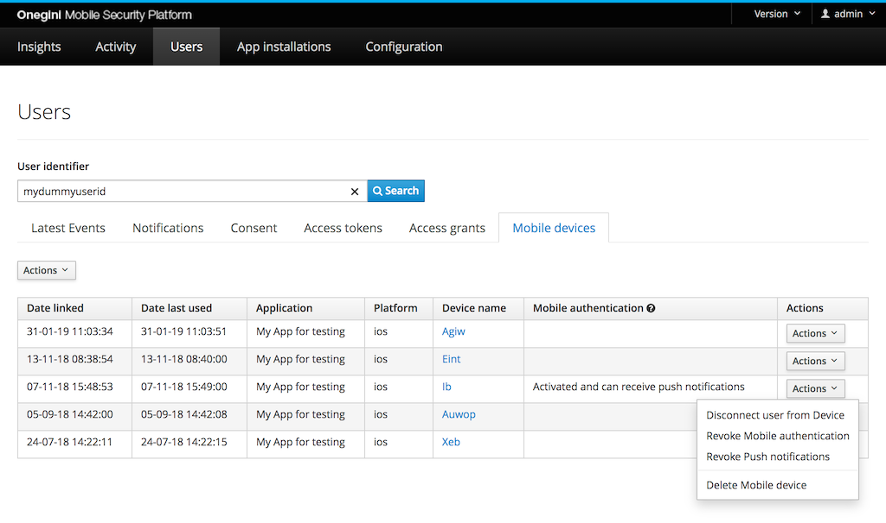

# User management

Onegini Access manages the users' access to the mobile applications that they have installed. There are a few ways to view or manage the end-users actions. 
For instance via the administration console you can search for a user to get an overview of all actions that a user has performed and what information is stored
of that user. All user management possibilities are explained in this topic guide.

>**Note:** Onegini Access itself does not manage user personal data such as name, email, etc. It merely consumes incoming data that is given to the 
Onegini Access during user authentication. The authentication mechanism must take care 
that all communication for a given user identifier (user ID) refers to the same user and that this ID is unique. The user identifier is therefore also the 
identifier that is used in order to find information about a specific user.

## Manage user information via admin console

Via the admin console you can get user information by going to the `Users` section. This section is accessible to all authorised users of the Onegini Admin 
console. It gives an overview of the events and data for a user. In order to see user data you need to enter the user identifier for a specific user.

### Latest events
Shows the latest 20 events for a user. More detailed filtering can be applied in the Activity section. The role ADMIN or OPERATOR is needed to access the 
Activity section.

### Consent
Shows the clients and scopes for which the user has given consent.

### Access Tokens
Shows the current known Access Tokens for the user. Expired or revoked tokens are cleaned up automatically. When it is indicated that a refresh token is issued, 
the application to which this token was issued has the ability to refresh it based on the either the user PIN or Fingerprint depending on the token type that is refreshed.

### Access Grants
This section should be empty unless a client has not yet exchanged the Access Grant for an Access Token. This might be in case a client is configured improperly or when a device is suffering with network connectivity issues.

### Mobile devices
Shows the mobile devices that a user has connected with Onegini Access. It also shows the application to which this mobile registration is linked. 

Modifications on mobile devices for a user are allowed for users of the Onegini Admin console with the role `admin`.

#### Disconnect user from device

This will disconnect the user from a mobile device. The functionality can be triggered per row item (via the Action dropdown in the Actions column) and
per user (via the Action dropdown above the table).

Disconnecting a user from a device enforces the user to enroll for the application again before it can be used by this user again. Other users using this same
device are not effected by the disconnect operation. When using the disconnect operation, the client credentials of the device are not removed.

#### Revoke mobile authentication

This option is only available if the user has activated a device for [mobile authentication](../../mobile-apps/mobile-authentication/mobile-authentication.md). 
The functionality can be triggered via the Action dropdown.

When the mobile authentication has been revoked, the user can no longer use the mobile device for authentication. To enable mobile authentication again, the 
user needs to enroll on a mobile device. This option will also revoke the activation for push notifications for this user on this device.

#### Revoke push notifications

This option is only available if the user has activated a device for mobile authentication with push notifications. The functionality can be triggered via the 
Action dropdown.

When the push notifications have been revoked, the user can no longer use the mobile device for authentication via push messages. They can still use the mobile 
device for other types of mobile authentication that do not require push messaging. To enable push notifications again, the user needs to enroll for push on a 
mobile device.

#### Delete mobile device

This will delete mobile devices for a user. The functionality can be triggered per row item (via the Action dropdown in the Actions column) and
per user (via the Action dropdown above the table).

When deleting a user's device, all users connected to the device are disconnected and must enroll again before using the application again. A list of users
connected to the device is prompted before the delete action can be approved. The delete operation removes the client credentials of the device, after using the
application again it will be registered as a new client.

## Manage a user via end user API

Via the end-user API you can perform get and delete actions for the following user specific data:
- access tokens
- consents
- devices
- access to applications

All actions mentioned above are described in the [end user API reference guide](../../../api-reference/end-user/index.md).