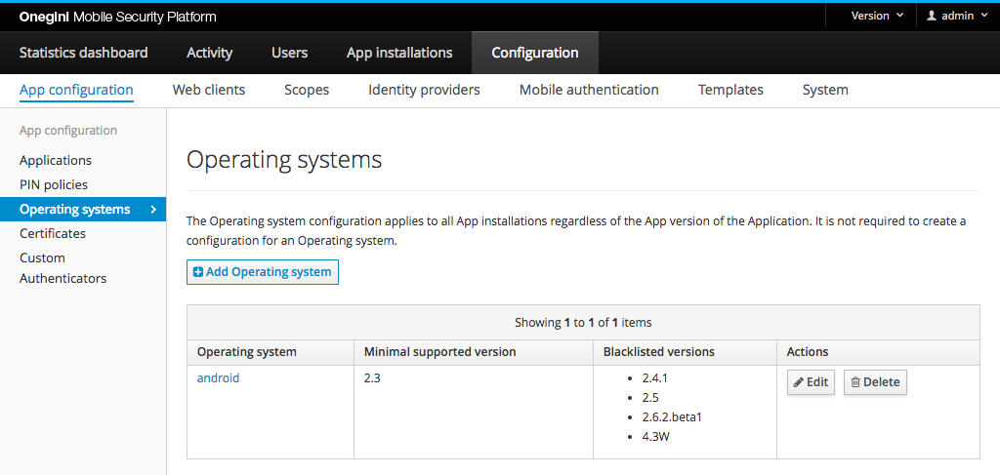
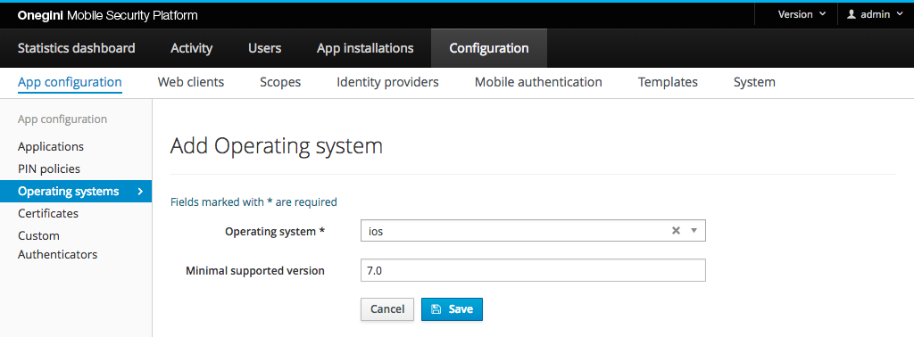
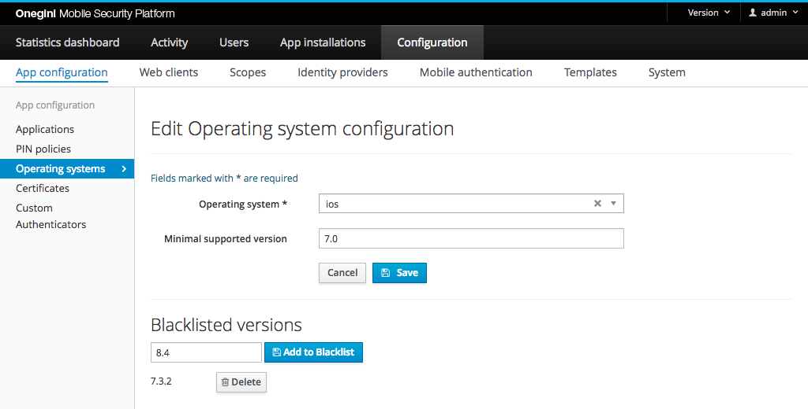

# OS version configuration

As an organisation you want applications to use only approved operating system versions to communicate with Onegini Access. Therefore OS version management is
an important feature of Onegini Access. This gives your organisation more control over which applications are allowed to communicate with your back-ends.

Each Operating System has their own versions. Hence, for every OS different versions can be accepted. It is not required to create a configuration for an
Operating system. If an OS does not have any configuration, it means that all versions are accepted for this OS. The OS configuration applies to all mobile
clients for a specific OS regardless of the configured application version. See
the [topic guide about application configuration](../../mobile-apps/app-configuration/app-configuration.md) for more information about application versions.

> **Warning:** There are several reasons why your users are using older versions of an Operating System. Phone vendors do not always offer the latest OS versions for the device of the user. Upgrading the OS can be a time consuming or impossible effort for a user due to network or space limitations. Hence, choose wisely when blocking specific OS versions.

In order to configure approved versions for a certain OS, go to the `Configuration` section of the administration console, then `App configuration` and click
the `Operating Systems` tab.

## Forcing end-users to upgrade

Only clients providing a valid OS version will be granted access by Onegini Access. The version is valid when it meets the conditions provided within the OS
configuration:

- is greater than the minimal version set (if a minimal version is configured)
- is not blocked

> **Note:** If there is no configuration for the Operating system, then every version of this OS is valid (in such situation OS version information is not required).

### Forcing end-users to upgrade their OS

Clients providing an invalid OS version will be forced to upgrade the OS version to a newer one in order to use your application again.

### Forcing end-users to upgrade their application

If a configuration for a certain OS is set and application running on that OS will not send the OS version information, the user of that application will be
prompted to upgrade the application version to a newer one that does provide the OS version to Onegini Access.

## Limit approved OS versions

The `Operating systems` section, located in the admin console, allows limiting approved OS versions in one of two following ways:

- specifying minimum OS version required;
- blocking specific OS versions.

The settings described here (blocked, minimum OS version) are optional and independent of each other.

### Configure minimal OS version

The minimum supported OS version can be set to the major (version 2), minor (version 2.1) or patch (version 2.1.4) release of the OS. Only the first three
numeric parts are parsed and the dot character (`.`) is expected as a separator.

Examples:

| Minimal version | Supported versions                          | Blocked versions |
|-----------------|---------------------------------------------|------------------|
| 2               | 2, 2.0, 3, 3.0.1                            | 0.5, 1, 1.9.9    |
| 2.1             | 2.1, 2.1.0, 2.1.1, 2.1.rev2, 3, 3.0         | 2, 2.0, 2.0.9    |
| 2.1.4           | 2.1.4, 2.1.4.beta1, 2.1.4-patch, 2.1.5, 2.2 | 2, 2.1, 2.1.3    |

### Block specific OS version

Use this option when one version of a mobile OS has a security vulnerability (e.g. 2.1.3), but others (e.g. 2.1.2, 2.1.4) do not. Another example is to allow
Android version 4.4 on tablets and phones, but block Android version 4.4w for wearables.

The request will be denied if the configured version exactly matches the value of the blocked version. Any value is allowed to be configured.

> **Note:** Normally you will configure the supported OS version at build time so that users who are not running the correct OS version will not be able to download your application. However, sometimes you need more drastic measures in case of security vulnerabilities but do not want to completely close down the application usage. In this case the OS blacklist will support you in blocking just the vulnerable OS versions.