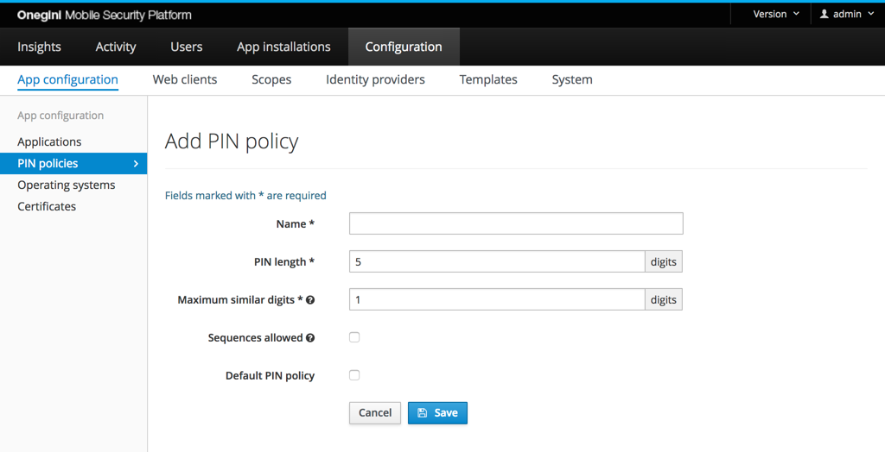
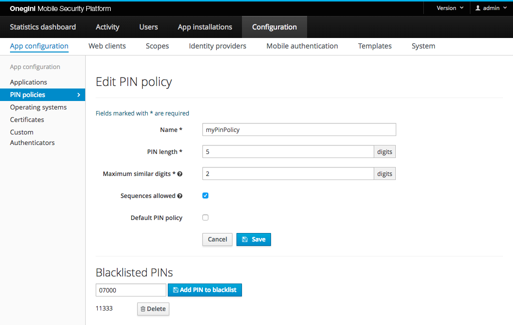

# PIN policy configuration

One of the options to login to an application is using a PIN. The PIN is coupled to a single application installation. When a user uses the same application on 
multiple devices he must chose a PIN on every device. He is free to choose to use the same PIN on every device. A PIN is only used to encrypt sensitive data 
that is stored locally on the device. Hence the PIN will NOT be communicated to the server.

A strong PIN is required to provide a secure login mechanism to end-users. To ensure users choose a strong PIN, the mobile application can be instructed 
via server side configuration what the policy for a PIN is. The length of the PIN depends on the implementation of the application, the SDK requires a minimal 
length of five digits.

For each application a different PIN policy can be configured. To configure a PIN policy in the admin console go to `Configuration`, `App configuration` and 
select the `PIN policies`.

## Configure a PIN policy

Via the PIN policy section in the admin console a PIN policy can be configured. A PIN policy is identified by its name. So it is advised to choose a name that 
makes sense.

The `PIN length` field can be set to a value between 5 and 32. We recommend usage of 5 as it is the industry standard.

The `Maximum similar digits` field indicates how many times the same digit is allowed to be repeated. For example, when the value is set to `2`, a PIN that 
contains `11` is accepted but `111` is not. Maximum similar digits cannot exceed the PIN length.

The `Sequences allowed` option indicates that a sequence is allowed or not. A sequence is a logical relation between digits. Examples of a sequences are `12345`, 
`13579` or `97531`.

A PIN policy can be selected per application. When no PIN policy is selected for an application the default PIN policy is used. The `Default PIN policy` 
checkbox indicates whether this PIN policy is the default one or not.

## Block specific PINs 

Some PINs might be commonly used but do not contain a sequence or too many similar digits. An example of such a PIN is `90210` or `00700`. Those PINs can be 
explicitly blocked.

Blocking specific PINs can be managed by editing an existing PIN policy. Specific PINs can be removed and added to the PIN policy block list.

>*Note:* When the PIN length is changed, all the existing blocked PINs are removed, because their length doesn't match the new PIN length.

