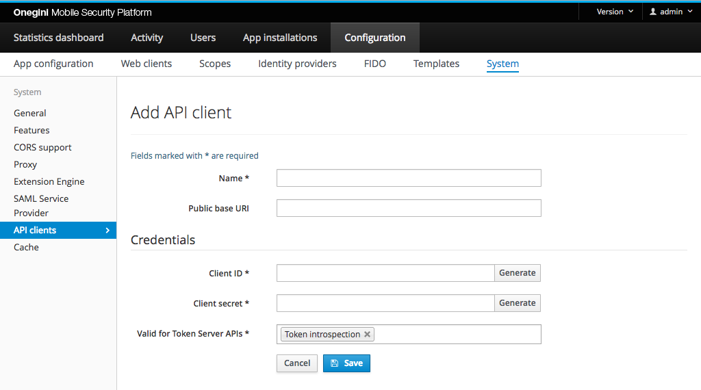

# Resource gateway configuration

In the overall architecture it is the responsibility of the resource gateway to grant or block access to specific APIs or resources. To evaluate if a client is 
allowed to use a resource, the resource gateway must validate an access token. Onegini Access provides a APIs to validate access tokens. 
Access to these APIs is restricted for OAuth clients with a specific role. Hence, the resource gateway acts as an OAuth client and needs to be configured as 
one.

## Network configuration

A resource gateway uses the `/oauth/api/v2/token/introspect` endpoint of Onegini Access for token introspection.
 
The network configuration should be adjusted to allow communication to this endpoint. Especially network traffic from the resource gateway to Onegini Access 
must not be blocked by firewalls.

## Configuration: an API client as resource gateway 

This configuration is needed for [token introspection](../../../api-reference/token-introspection.md).

An OAuth API client can be configured as a resource gateway via the admin console. In order to create a resource gateway, go to the `Configuration` section 
in the admin console and open the `System` tab and `API clients` section. Here you can find all the existing API clients. To add a new one, click on the Add 
button. The following form will appear:

A resource gateway requires a few fields to be filled in the form:

 * **Name** - The resource gateway is referenced using the value from this field.
 * **Client ID**, **Client secret** - This pair of values is used to authenticate the resource gateway when it communicates with Onegini Access. Those values 
 can be filled or generated. This information is sensitive and should be treated accordingly.
 * **Valid for APIs** - The resource gateway uses scope: `Token introspection`, and that one must be selected in this field.
 * **Public base URI** - The base uri (public endpoint) of the resource gateway.
