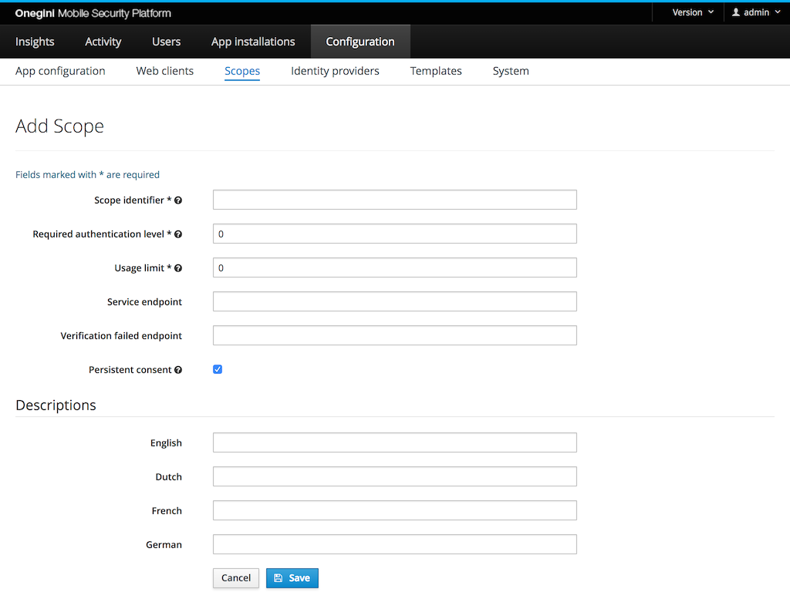

# Scopes configuration

Scopes are a representation of the data or actions that an application can access or perform. The scopes can be freely defined by you and therefore access can be 
limited by creating a fine-grained policy. Social networks such as Facebook and Google have defined a large number of scopes to limit access to certain 
applications only to the parts that they really need access to. Examples of such scopes are: `profile`, `email`, `user_likes`, `user_posts`. 

This way the opportunity for abuse can be greatly limited. Scopes are linked to an access token 
that is issued to an application on behalf of an end-user. In case of a client credentials access token it is not on behalf of a user but only on behalf of the 
application. In order to request scopes an application needs to request them during the authorization flow. A user will be optionally presented with a consent 
screen to allow the application to use certain scopes. The consent screen is particularly for scenarios where the application is managed by a third-party. 
You are probably familiar with consent screens if you have logged in to a website using one of your social media accounts. The first time you login you need 
to give consent to share your personal data with the third-party application / website.

An application can have two types of scopes: default and additional. Default scopes are automatically assigned if a client does not request any scopes. Both 
additional and default scopes can be requested by an application during an authorization request. Each application configuration can have various default and 
additional scopes defined. When an application requests a scope that is either not assigned to this application or does not exist the request will be rejected.

To configure a scope in the admin console go to `Configuration`, `App configuration` and select the `Scopes` tab.

## Configure scopes

A scope represents an action to be executed or data to be accessed by the application.
The **Scope identifier** field should reflect this action or data so it can be easily identified or recognised. A possible value could be: `read` or `email`. 
The scope identifier is used in OAuth flows when an Access token is requested or validated.

The **Required authentication level** is used to restrict access to a scope. The value must be a positive number.
The initial authentication level of the user is set by the [Identity Provider](../identity-providers/identity-providers.md). If the current authentication level 
of the user is lower than the required level during an authorization request, the user will be redirected to the configured authentication server.  
When multiple scopes are requested by an application the value for the highest level over all scopes is required.

The **Usage limit** is the number of times an access token for this scope can be used. When the value is `0`, the access token usage is unlimited. If a higher 
limit is set, no refresh token will be provided. When multiple scopes with a usage limit are requested by an application the lowest value for all scopes is used.

The **Service endpoint** field contains the endpoint to check whether the end-user is authorized to access that scope. It can be linked to a subscription or purchased 
product so users not having a certain subscription or product can be denied access to an application. An example endpoint value is: `https://example.com/scopes/read`. 
This field is not required.

The **Verification failed endpoint** field contains the endpoint the user will be redirected to when the user is not authorized to access the scope. 
This field can for instance be used to send the user to a page where an upgrade or subscription offer is made. This field is not required.

The **Persistent consent** checkbox indicates the type of the scope. Persistent scopes are scopes that user should give consent during the first authorization request.
With non persistent scopes user consent is required each authorization request. This option is checked by default in a new scope configuration form.

The **Descriptions** fields can be used to provide an explanation for the end-user which details are communicated upon giving consent for this scope. A 
description can be set for all supported languages. In order to change the default language the order of the supported locales need to be changed via the admin
console: System &rightarrow; General &rightarrow; Supported Locales.
