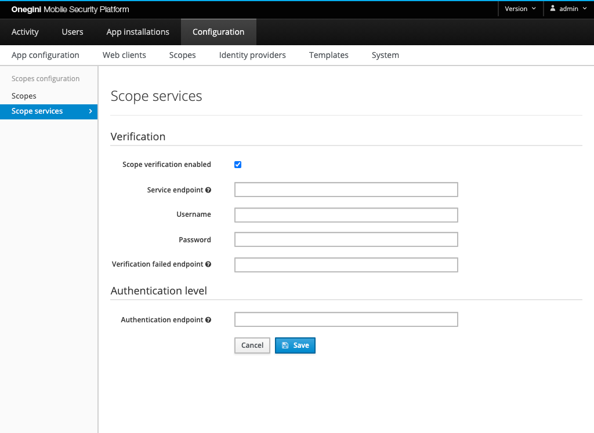

# Configure Scope Verification Service

This section describes how to configure Scope Verification Service for Onegini Access.

## REST-based Scope Verification Service

Onegini Access assumes Scope Verification Service to be available as an external application exposing HTTP endpoint for scope verification.
This service can either be a small component that translates our API to a vendor specific API or it can be a middleware layer which already has access to the implementation.

The REST API that Onegini Access uses is described in the [API specification](../../../appendix/api-rest-services/scope-verification-service.md).

Scope verification service properties can be configured in the Scope services section in the admin console:

| Property                       | Example                                   | Description                                                                                                            | 
|--------------------------------|-------------------------------------------|------------------------------------------------------------------------------------------------------------------------|
| Scope verification enabled     | true                                      | Indicates if REST-based scope verification is enabled. When disabled, the user is authorized without verifying scopes. |
| Service endpoint               | http://service.endpoint.com               | External REST endpoint which is called during scope verification.                                                      |
| Username                       | username                                  | Basic auth username for the scope verification service endpoint.                                                       |
| Password                       | secret                                    | Basic auth password for the scope verification service endpoint.                                                       |
| Verification failed endpoint   | http://verification.failed.endpoint.com   | Default endpoint the user should be redirected to when it is not authorized for a scope.                               |
| Authentication endpoint        | http://authentication.endpoint.com        | Endpoint the user should be redirected to when its authentication level is not sufficient.                             |
