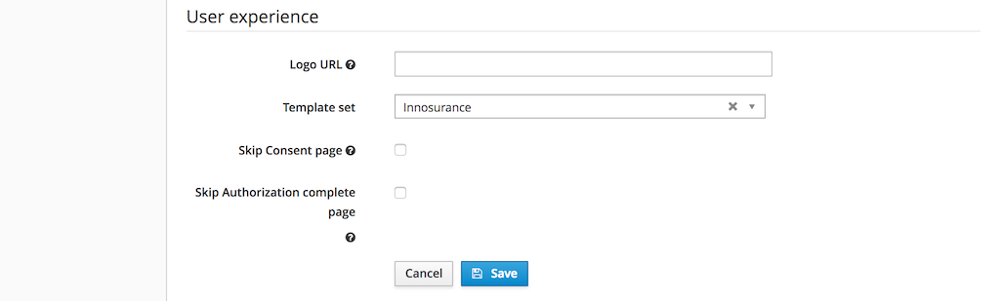

# Templates

Onegini Access uses the [Thymeleaf](https://www.thymeleaf.org/) template engine to serve pages to the end user via a browser. The templates can be customized to
align their look and feel with your mobile application or company standards.

## Customizing templates

Onegini Access uses template sets which contain one or more custom templates. The default template is used when a specific template is not available in the
template set. One custom template set can be marked as the default template set for all applications and web clients.

Customized templates can be uploaded and managed via the [Self Styling application](../../../../../self-styling). In order to add the new template set follow
the [directory structure](../../../../../self-styling/configuration-page.md)
in the configured git repository. Refer to the [default template set](./content/access-engine-templates.zip) to further customize templates.

In the templates the [Thymeleaf Layout Dialect](https://github.com/ultraq/thymeleaf-layout-dialect) and
[Thymeleaf With Dialect](https://github.com/Antibrumm/thymeleaf-extras-with-dialect) are supported. The template file names are hardcoded and should be equal in
the custom template set. The internals of the template like message keys and fragments can be different. For more details about the different templates
supported by Onegini Access see the [templates section in the appendix](../../../appendix/templates/templates.md).

## Configuring an application specific template set

For each mobile application and web client a template set can be configured to render screens in the look and feel of this application or web client. When no
template set is configured for an application or web client, the default template set is used to render these screens.

## Resolving templates

Onegini Access resolves templates in the following order:

1. Within the template set that is configured for the application or web client of the current request.
2. When the template is not present in this set, within the template set that is marked as the default template set.
3. When no template set is marked as default or when the template is not found, within the templates that are bundled with Onegini Access.

## Static resources

An application server like Onegini Access is not optimized for server static resources like javascript, images and css files. Therefore Onegini Access does not
support serving custom static resources. Some options on how to use custom static resources:

- Embed the static resources in the html of the templates. The downside is that the client cannot cache the static resource.
- Serve the static resources via the organisations content management system.
- Serve the static resources via the Onegini Content Server, docker based micro service which can optionally be deployed next to Onegini Access.
