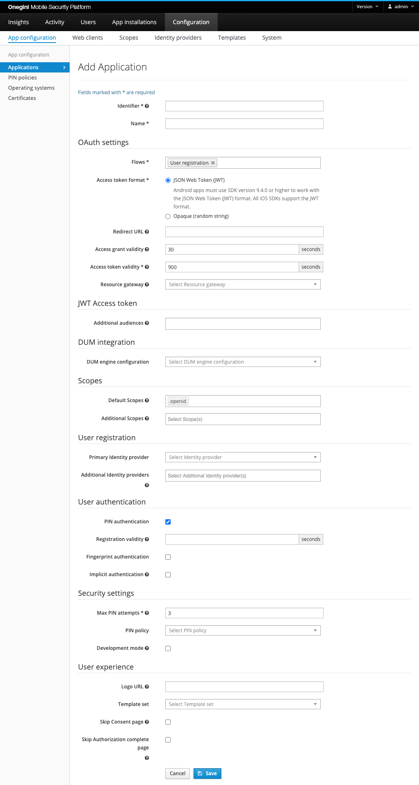

# Mobile application configuration

Mobile Applications typically using the Onegini SDK to communicate with an Onegini Access instance and need to be configured via the admin console. This 
section describes the steps related to configuration of these applications.

## Creating a new application

In order to create a new application, go to the `Configuration` section of the administration console and click the `App configuration` tab.
On the overview that is shown you can see all the existing applications.

>**Note:**
> **Applications** are meant for mobile applications that are installed on a device that is not managed by you or a trusted party. In general this are your 
customers' mobile devices. These can be exposed to all kinds of attacks and the application configuration combined with the Onegini SDK provides the necessary 
protection against that. These clients are also named dynamic clients.

To add a new application click on the add button. The following form will appear:

Fill all the mandatory fields (marked with `*` on the form). The other fields are optional.

| Field                                | Required | Example value       | Details
|--------------------------------------|----------|---------------------|--------------------------------------------------------------------------------------------------------------------------------------------------------------------------------------
| Identifier                           | yes      | app1                | Unique identifier for this application.
| Name                                 | yes      | My demo application | Display name of this application. This is only used for informational purposes in the Admin console and end-user API.
| Flows                                | yes      | User authentication | Supported flows for an Application. The available options are explained in a section below.
| Access token format                  | yes      |                     | Defines whether the [Access token](../../tokens/access-token.md) is returned as JSON Web Token (JWT) or as Opaque (random) string. Android apps must use SDK version 9.4.0 or higher to work with the JSON Web Token (JWT) format. All iOS SDKs support the JWT format.
| Redirect URL                         | yes      |                     | Location to which the end-user is redirected after successful authorization. This URL starts with the custom app scheme (e.g. myapp://) and this is the full URL to which the end-user is redirected after they have successfully logged in and given authorization for the requested scopes. This is the primary redirect URL and will be included in the application version export.
| Additional redirect URLs             | no       |                     | Additional URLs to which the end-user can be redirected. See "Redirect URL". Used to change the redirect URL for an already deployed application - the previously used redirect URL need to be moved as additional URL and the new one can be supplied as primary redirect URL. Mind that the `additional redirect URLs` are not exposed within application version export.
| Access grant validity                | depends  | 30                  | Number of seconds an access grant is valid. This is the time an application has to exchange an authorization grant (a.k.a access grant) for an access token. In a common scenario this is done in at most a couple of seconds. Required for flow `User registration`.
| Access token validity                | yes      | 900                 | Number of seconds an access token is valid. An access token is the temporary key with which an application can fetch resources. When this period has expired the access token has to be refreshed using a refresh token.
| Resource gateway                     | no       |                     | A mobile app typically uses a [resource gateway](../../general-app-config/resource-gateway/resource-gateway.md) to fetch data from backend services. Here you can specify the resource gateway which this application will be talking to. It is also used to populate the `aud` claim in a JWT access token.
| Additional audiences                 | no       | aud1, aud2          | A set of case sensitive strings that identifies the audience of the issued access token besides the resource gateways. It is used to populate the `aud` claim in a JWT access token.
| Delegated Administration configuration             | no       | myDumConfig         | Configuration of Delegated Administration that should be used to gather person report containing information about group memberships and permissions.
| Default scopes                       | no       |                     | The scopes that are assigned to an authorization request if no scopes are requested. If no scopes are requested by the application in the authorization request and no defaults specified Onegini Access will fail the request.
| Additional scopes                    | no       |                     | The scopes the application is allowed to request apart from the default scopes. The default scopes are also counted as scopes that can be requested by an application.
| Primary Identity provider            | depends  | myIdp               | The identity provider used when a user authenticates for this application. See the [Identity Provider configuration topic](../../general-app-config/identity-providers/identity-providers.md) for more information on Identity Providers.
| Additional Identity provider(s)      | no       | addIdp1, addIdp2    | Additional identity providers that can be used when a user authenticates with this application. A primary must be specified if additional are entered.
| PIN authentication                   | no       | true                | Flag to enable authentication via PIN after the user has registered.
| Registration validity                | no       | 7200                | Number of seconds the user registration in the app is valid. The user needs to register again after exceeding that time. Available when `PIN authentication` is enabled. When left empty, the user registration in the app does not expire.
| Fingerprint authentication           | no       |                     | Flag to enable authentication via Fingerprint for this application after the user has registered.
| Custom Authenticators enabled        | no       |                     | Flag to enable Custom Authenticators for this application.
| Custom Authenticators                | no       |                     | Configures which Custom Authenticators are allowed for this application. Required if Custom Authenticators are enabled for this application.
| Implicit authentication enabled      | no       |                     | Flag to enable implicit authentication for this application. Can be enabled when the registration flow is enabled.
| Max PIN attempts                     | yes      | 3                   | Max number of times a user can provide a valid PIN before the application is revoked and the user has to authorize the app again. When the value is set to 0 the number of attempts is unlimited.
| PIN policy                           | no       | my PIN policy       | PIN policy that will be used by the mobile application during the PIN creation process. Please see the [PIN policy topic](../../general-app-config/pin-policy/pin-policy.md)
| Certificates                         | no       |                     | Certificates that are used by the App to establish a secure connection with Onegini Access and other backend systems. The selected Certificates will be part of the configuration file that you can export for your Application.
| Development mode                     | no       | false               | When the development mode is selected the configured application signature is ignored and the developer does not have to configure a new application signature for every new version of the application. To learn more about the application signature check out the [Application version management topic](app-version-management.md).
| Logo URI                             | no       |                     | URI of the logo for this application, it can be used in for example the consent screen.
| Template set                         | no       | payment-app/        | Every application can have its own branding. Therefore multiple sets of templates are supported. The prefix corresponds to the directory in which a set of templates is stored.
| Skip Consent page                    | no       | true                | In the OAuth flow consent is requested because an application requests access to the user's data. When the application is managed by a third party you may want to notify the user that this application will have access to his personal information. Which information an application has access to is defined by the requested scopes. When consent is disabled the user is not required to give consent for the application during the authorization process.
| Skip Authorization complete page     | no       |                     | If the registration for the mobile app is handled in the browser, it is highly recommended to show a page in the browser before you send the user back to the app. This page serves two purposes: you can inform the user that they are going back to the mobile app, and you can prevent that the browser tries to open the app later. Without this page, the user would be asked to open the mobile app when they open the browser later again. When enabled, this page will be shown both when the registration has succeeded and when the registration has failed because caused of explicit user interaction, for example when they have canceled the authentication. The authorization complete step will not be triggered when the error is caused by misconfiguration or an invalid authorization request (e.g. passing an invalid identity provider identifier, invalid OpenID Connect (OIDC) parameters for `max_age` or `acr_value`). When the application uses an in-app browser or native screens for the registration, this page is not required, and it can be skipped. 

Additional information about the configuration of a [Pin policy](../../general-app-config/pin-policy/pin-policy.md), a [Resource gateway](../../general-app-config/resource-gateway/resource-gateway.md), [Scopes](../../general-app-config/scopes/scopes.md) and an [Identity provider](../../general-app-config/identity-providers/identity-providers.md) can be found in separate chapters.
Utilizing `Additional Identity provider(s)` is handled by the SDK. Refer to the 
[iOS SDK](https://developer.onewelcome.com/ios/sdk/identity-providers) or [Android SDK](https://developer.onewelcome.com/android/android-sdk/user-registration) documentation for help with adding support for multiple Identity Providers.

All mobile applications are an [OpenID Connect](../../oidc/overview/overview.md) Relying Party. A separate page is shown for the [OpenID Relying Party configuration](../../oidc/configuration/configuration.md#openid-connect-relying-party-configuration) after creating or updating the application.

### Description of flows

Flows can be configured for an Application.

| Flow                  | Description 
|-----------------------|--------------------------------------------------------------------------------------------------------------------------------------------------------------
| User registration     | Specifies whether an application can use the OAuth authorization code grant type in order to allow this application to request an access token on behalf of the end-user.
| Anonymous resource calls    | Specifies whether an application can use its client credentials to request an access token. Note that this access token is not linked to a user since it's solely requested by the application without any user interaction. This function is typically used to fetch resources before the user has authenticated.

## Removing an application

In order to remove an application, Go to the `Configuration` tab of the administration console. On the list of applications find the one you want to remove and 
click on the delete button on the right (You will be asked to confirm you decision).

Please note that you cannot remove an application that is already in use. In use means there are already registered clients using this application. An alternative
could be to [disable all application versions](app-version-management.md#force-users-to-upgrade) so the application cannot be used anymore.
