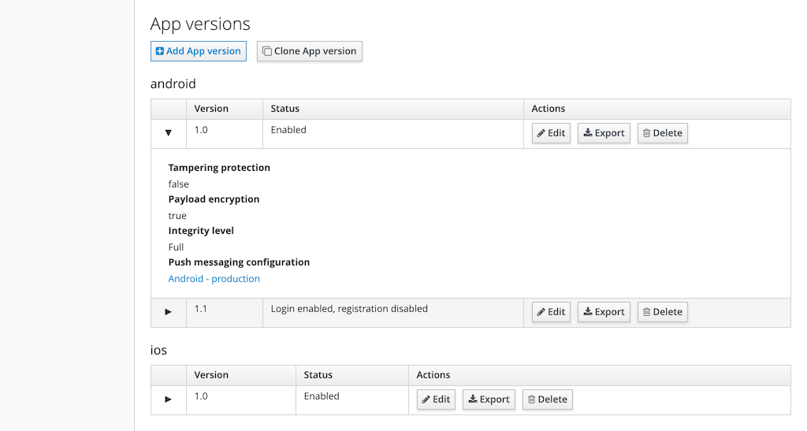
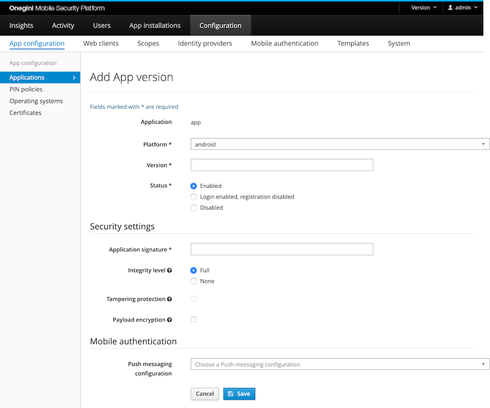
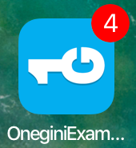

# Mobile application version management

As organisation you only want approved application versions to be able to communicate with Onegini Access. Therefore application version management is an
important feature of Onegini Access. Each application version which is published must be configured. When talking about an application version a version of
the application for a specific platform is used. So for example: `PaymentApp v1.1 Android`. 

An application should prove it is the application version it pretends to be when it communicates with Onegini Access for the first time. When this is proven the 
application will receive credentials which can be used for further communication. Based on these credentials all requests for this application can be correlated
to this specific application installation.

In order to create a new application, go to the `Configuration` section of the administration console, then `App Configuration` and open the `Applications` tab. 
From the list of applications click on the application identifier in the `Identifier` column. At the bottom of the screen the versions for this application can 
be managed.

## Configure a new application version

Click on the `Add App version` button to create an App version from scratch. Click on the `Clone App version` button to create an App version with the same configuration as an existing version.

The `Version` fields need to be filled with a version identifier of the mobile app for that platform. The version identifier is a free format text field. It is
advised to use [semantic versioning](https://semver.org/) to see the relation between versions in terms of which is the latest.

The `Status` defines whether the Onegini Access accepts requests from app installations for this version. The status field has three options:

1. `Enabled`: this version of the application can register itself as a new application installation on the Onegini Access and existing application
   installations can be used.
2. `Login enabled, registration disabled`: only applications that already had registered before can keep using the Onegini Access without upgrading. New
   registrations for this app version are denied.
3. `Disabled`: completely disable the usage of a specific version. For example, when a version configuration is created for future usage, the version contains a
   severe issue which requires it to be disabled, or when a version is so outdated that customers cannot use it anymore.

### Security settings

#### Application signature

The application sends a signature with every request to the Onegini Access to prove that it is a genuine app installation. An app developer will deliver
application signatures as described in the [App delivery lifecycle topic](../app-delivery-lifecycle/app-delivery-lifecycle.md#final-steps). Application
signatures are sometimes referred to as Application thumbprints or Application secrets. Configure their values in the `Application signatures` fields.

The `Integrity level` defines the strictness of the verification of the application signature. When level `Full` is configured, the application signature must
match a checksum on the device. The values of the configured application signature are not verified when the integrity level is `None`.
Level `None` is only recommended for development purposes.

> **Note:** The integrity level is only used for Onegini's Android SDK 11+ and iOS SDK 10+. Earlier versions use the settings for Development mode and
> Tampering protection.
To prevent tampering with the application, for example via byte code manipulation, `Tampering protection` checkbox should be enabled. With tampering protection
the application has to prove its identity to the Onegini Access in a more strict way.

> **Note:** Tampering protection option for iOS SDK 11+ is deprecated. Use Integrity level FULL and use a new App Signature (App ID) calculated from TeamID and BundleID instead of the one created from the calculator. For more info check [here](https://developer.onewelcome.com/ios/sdk/application-integrity).

When tampering protection is enabled the Application signature has to be a hexadecimal formatted string of 32, 48 or 64 characters. When an Application
signature contains a `|`, it indicates that it supports multiple architectures, e.g. 32 and 64 bit. Each architecture returns a unique signature for the same
mobile app version. These parts are combined via the `|` into a single application signature. When tampering protection is enabled, the validation rules apply
on all parts of the Application signature separated by the `|` individually. For example, the application signature `12345|ABCDEF1234567890ABCDEF1234567890` is
not valid because the first part does not have the correct size.

> **Note:** Development mode and Tampering protection are used for mobile apps with Onegini's Android SDK 10 or lower and iOS SDK 9 or lower. Newer Onegini
> versions use the Integrity level.

#### Payload encryption

For the communication of sensitive information TLS/SSL might not be sufficient. The `Payload encryption` feature adds a layer of encryption to the request and
response. When an attacker is able to compromise the TLS transport layer, they cannot read the contents of the messages because their payload will be encrypted
as well. An installation of the Onegini Security Proxy is required to use payload encryption. Enabling `Payload encryption` without the
Onegini Security Proxy does not have any effect.   

### Configure mobile authentication

> **Note:** The mobile authentication configuration is only available when the mobile authentication feature is enabled on system level.

#### Configure push messaging

`Push messaging configuration` can be selected from the dropdown list. It only shows the Push messaging configurations for the selected platform. For more 
information about it go to the [Mobile authentication page](../mobile-authentication/mobile-authentication.md).

#### Push messaging to Cordova app

This option is only visible for Android. Enable this when you send push messages to an Android app that is using Cordova. When enabled, extra
parameters are added to the push message. These are needed to receive the notification when the Cordova app is running in the background.

#### Use APNs development environment

This option is only visible for iOS. This specifies whether the production or development APNs environment is desired. By default, the production environment will be used.

#### Send badge number

This option is only visible for iOS. The badge is the number of unread notifications for an app shown on top of the app icon. When this setting is enabled, it will update the badge with the number of pending push authentications when the push message is sent.

> **Note:** This setting is only present for iOS because an iOS application does not get started until the user clicks on the notification while the android application is started in the background as soon as the notification is received by the device.

#### Set Application bundle identifier

This option is only visible for iOS. The Application bundle identifier is a unique identifier of an app. It uses the reverse domain name notation. You can find it in the [Apple developer account](https://developer.apple.com/account/ios/identifier/bundle).

## Remove an existing app version

Via the application version list a trash icon can be found. An app version can only be removed when no application installations are using the application 
version. An alternative to removing a version is [forcing end-users to upgrade](#forcing-end-users-to-upgrade).

## Forcing end-users to upgrade

There are several reasons why you would like end-users to upgrade their applications. For example:
* Reduce support costs due to less application versions.
* Act on known security vulnerabilities.
* Backwards incompatibility with backend systems.
* Force users to start using the latest features.

In order to force users to upgrade to a newer application version the old application version must be disabled. This can be achieved by editing the old version and 
set the Status to `Disabled`. Users will be prompted to upgrade via the app store when using the disabled application. After upgrading from an 
application version which is disabled the user can use the application again without having to register again.

>**Note:** Users might experience bad usability when they are forced to upgrade when users only have a mobile connection available. Forcing a user to upgrade 
makes the current application version unusable.

## Prevent new installation usage of the application

To prevent new application installations of an outdated version the version can be disabled for new registrations. This can be achieved by editing a version and
set the Status to `Login enabled, registration disabled`. Users will be prompted to upgrade via the app store when using the application for the first time.
Users that already used the application before won't notice any disturbance. After upgrading or downgrading from an application version which is disabled, the
user can use the application again without having to register again.

