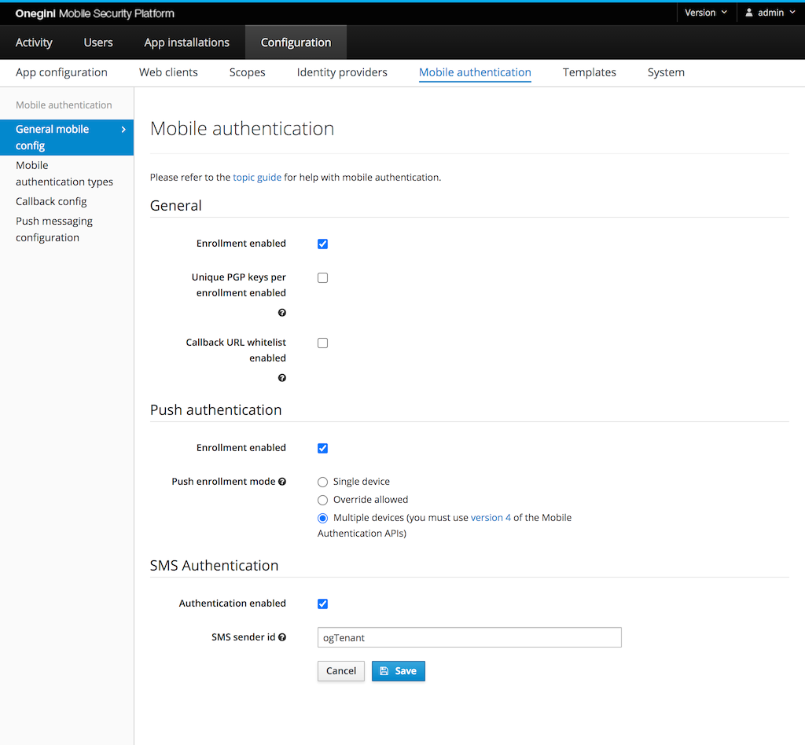
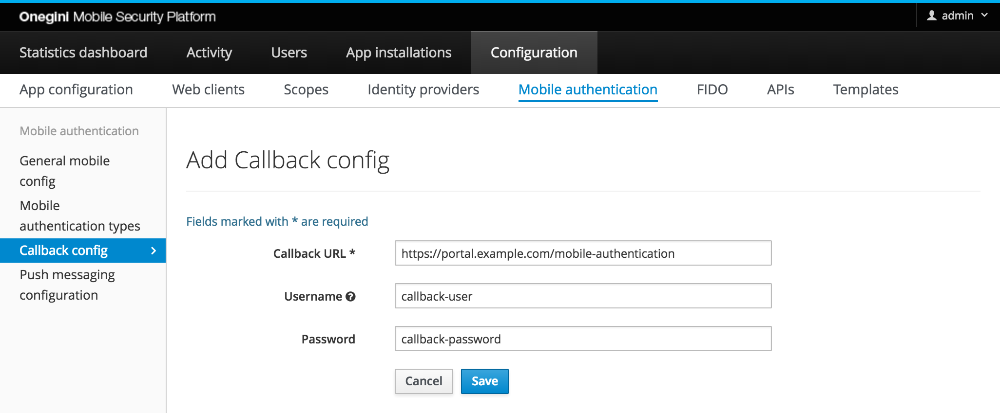

# Mobile authentication

## Introduction
The end-user can approve actions using mobile authentication. These actions can be bank transfers or purchases, but you can also utilize mobile authentication
to sign in to a website. There are three methods to interact with the end-user: via push messages, text messages (SMS), or a One Time Password (OTP). The
process for the mobile authentication will differ per method.

The user flows and configuration options per method are described in their specific pages:

* [Push authentication](push-authentication.md)
* [SMS authentication](sms-authentication.md)
* [One Time Password](one-time-password.md)

## General configuration

In the admin console, go to `Configuration` &rightarrow; `Mobile authentication`. The configuration options on this page are explained on the pages for each 
authentication method.

When `Mobile authentication` is not visible, you must enable it as a feature in `Configuration` &rightarrow; `System` &rightarrow; `Features`.

## Configuration for Callback endpoints

The configuration for Callback endpoints serves two purposes:

1. Restrictions: if the option `Only allow preconfigured Callback URLs` is enabled in the Mobile config, the mobile authentication will only
   succeed when the callback URL in the request matches one of the preconfigured Callback URLs.
2. Authentication: configuration of the credentials for basic authentication on the callback endpoint.

| Field                 | Required  | Description                                                                                                         |
|-----------------------|-----------|---------------------------------------------------------------------------------------------------------------------|
| Callback URL          | yes       | URL that is used for the callback of mobile authentication. Must match exactly with the requested callback URL.     |
| Username              | no        | Optional username for basic authentication when calling the Callback URL.                                           |
| Password              | no        | Optional password for basic authentication when calling the Callback URL.                                           |

## Adding additional context to the Secure Message

Both Push and OTP types give the ability to specify additional parameters as part of the initialization process to give users more context about where
the request is originating. This is useful in mitigating phishing attempts since the user is given more details before they confirm the requested action.

In order to enable this feature the following conditions must be met:

* the geolocation feature is enabled and properly configured
* the mobile authentication [initialization request](../../../api-reference/mobile-authentication/mobile-authentication-v4.md#mobile-authentication-initialization)
  contains the following optional fields: `ip_address`, `user_agent`.

It is possible to customize the way additional context is added to the secure message by modifying the template available under
`mobileAuthentication.confirmation.template` key. This template contains predefined placeholders that are replaced at runtime with the actual values.

| Placeholder     | Init parameter   | Example value                       | Description                                                                         |
|-----------------|------------------|-------------------------------------|-------------------------------------------------------------------------------------|
| message         | `secure_message` | You are logging into the XYZ portal | The secure message provided as a part of mobile authentication initialization       |
| operatingSystem | `user_agent`     | Mac 10.14                           | The end-users' operating system detected based on the user-agent http header        |
| browser         | `user_agent`     | Chrome 73.0                         | The end-users' browser of the end-user detected based on the user-agent http header |
| countryCode     | `ip_address`     | NL                                  | The end-users' code of the country detected based on the ip address                 |
| region          | `ip_address`     | Provincie Utrecht                   | The end-users' region detected based on the ip address                              |
| city            | `ip_address`     | Utrecht                             | The end-users' city detected based on the ip address                                |

By default, the template has the following value:
`[message] Device: [operatingSystem] [browser], Location: [countryCode], [region], [city]`

The placeholders correspond to the different init parameters as defined in the table above. For example, if you don't send `user_agent`
during the init request, you will not get back values for `operatingSystem` or `browser`.

You should coordinate the formatting with the device that will be displaying this message to make it more readable/clear. You can also mix and match the order
phrasing. For example:
`[message] using [browser] from [city], [countryCode]` would yield `You are logging into the XYZ portal using Chrome 73.0 from Utrecht, NL`

The template mechanism supports [internationalization](../../look-and-feel/translations/translations.md).
The actual language used in each case is picked based on the `language_code` field provided together with `ip_address` and `user_agent`
as a part of mobile authentication initialization request. If no template exists for the specified `language_code` or `language_code` is not provided,
the template will default to English.

Any error encountered during geolocation resolution such as the service being inaccessible/unavailable or an incomplete/malformed response being returned will
result in only the base message being sent to the mobile application. An event will also be logged indicating the error in the administration console for help
with troubleshooting.
