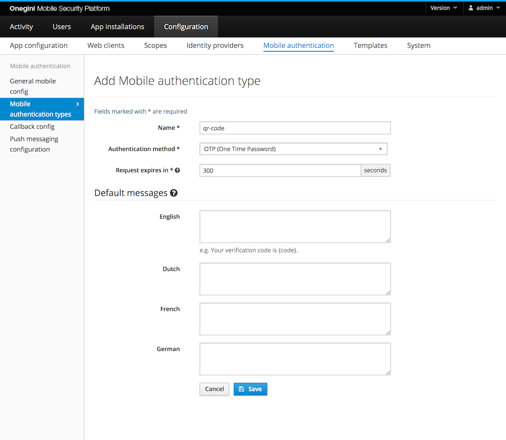

# One Time Password

## Introduction

For One Time Password (OTP) authentication, the user's application obtains an OTP directly from the portal. For example, after having initialized a mobile
authentication request (without specifying the user), the web portal may display a QR code that the user can scan using their app. The OTP is then used to link
the user's unauthenticated session on the portal to the authenticated session in the app.

The end-user must have installed a mobile app with the OneWelcome SDK to use mobile authentication via OTP. After the end-user has installed the app, they must
enroll their app for mobile authentication. The website initiates the mobile authentication at OneWelcome Access which returns a (long) code. A common process is
to include this code in a QR-code which the end-user can scan with their mobile device. When the end-user is already on their mobile device, you can create a
link that opens the mobile app. The mobile app then sends the code to OneWelcome Access which will notify the website about the result.

## Configure mobile authentication enrollment rules

Go to the `General` subsection in `General mobile config` section to configure the mobile authentication enrollment. `Enrollment enabled` must be checked for
One Time Password authentication.

PGP encryption keys are used to enroll devices in order to use mobile authentication with push.

By enabling the `Unique PGP keys per enrollment enabled` option in `General` subsection in the admin panel, for every user enrollment a new PGP key pair will be
generated. For better performance it is advised to not enable this option.

## Mobile authentication type configuration

Go to `Configuration` &rightarrow; `Mobile authentication` &rightarrow; `Mobile authentication types`.

The following fields are required:

* Name: this is used to identify the type when calling the [mobile authentication API](../../../api-reference/mobile-authentication/index.md)
* Authentication method: OTP (One Time Password)
* Request expires in: the time the user gets to complete the authentication via OTP
