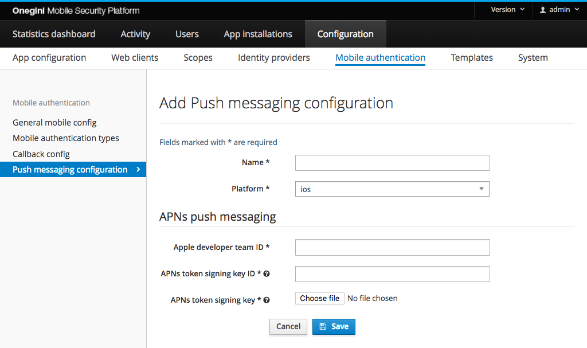
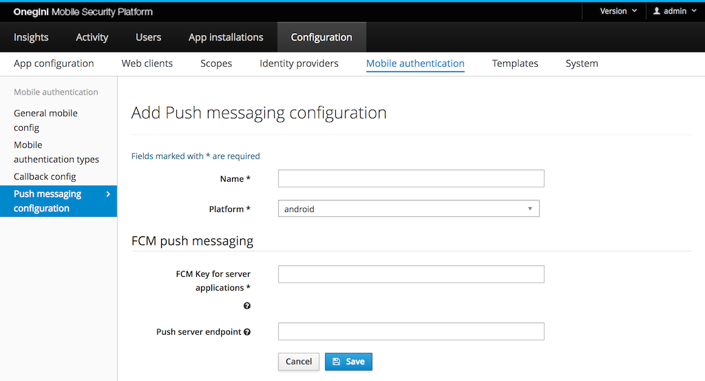
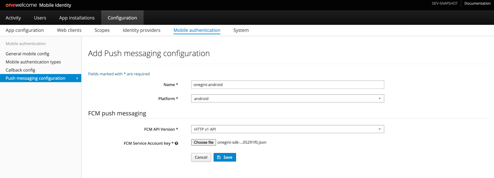
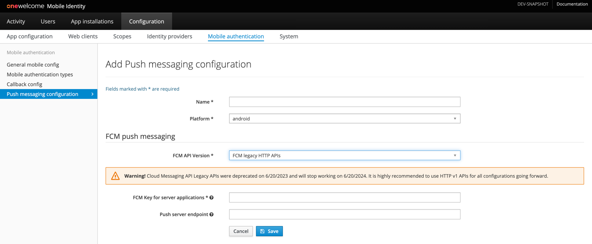
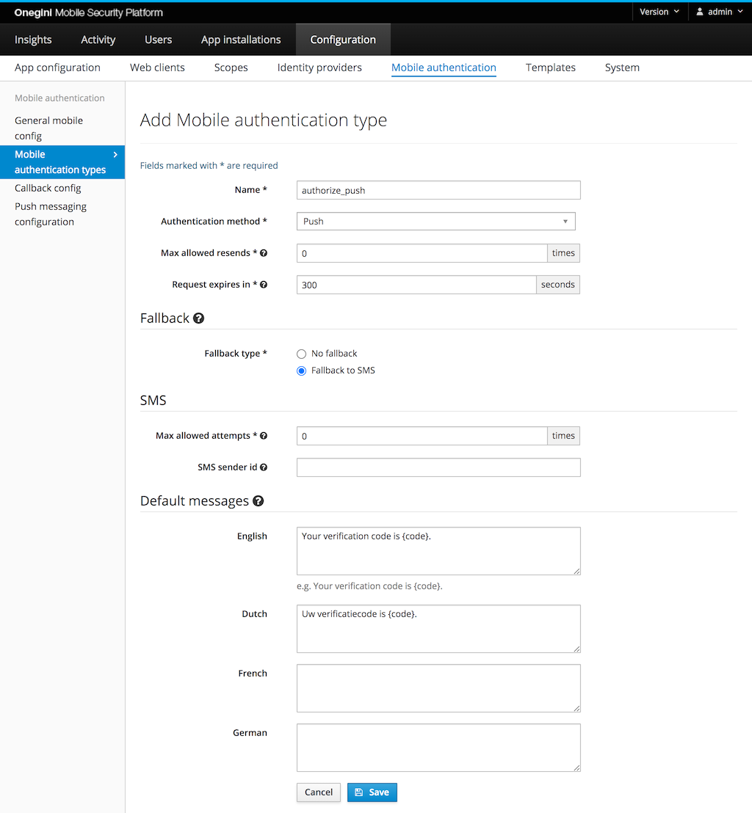

# Push authentication

## Introduction

Mobile authentication can be performed via push messages that are sent to the user's mobile device.

The end-user must have installed a mobile app with the OneWelcome SDK to use mobile authentication via push messaging. After the end-user has installed the app,
they must enroll their app for mobile authentication with push messaging.
The website initiates the mobile authentication at OneWelcome Access which sends a push message via Google's FCM or Apple's APNs service to the mobile
device. When the end-user interacts with the push message, the mobile app is opened. The mobile app will ask the end-user to approve the transaction. For extra
security, the end-user may need to authenticate by entering their pin, or using biometric authentication (finger print, face recognition). This is configurable.
The OneWelcome SDK sends the approval result to OneWelcome Access which then notifies the website.

## Configure enrollment
### Configure mobile authentication enrollment rules
Go to the `General` subsection in `General mobile config` section to configure the mobile authentication enrollment. `Enrollment enabled` must be checked for push authentication.

PGP encryption keys are used to enroll devices in order to use mobile authentication with push.

By enabling the `Unique PGP keys per enrollment enabled` option in `General` subsection in the admin panel, for every user enrollment a new PGP key pair will be generated. For better performance it is advised to not enable this option.

### Configure enrollment for mobile authentication with push rules

>**Note**: In order to be able to configure push enrollment rules, mobile authentication enrollment must be enabled. Mobile authentication with push enrollment
is not possible without mobile authentication enrollment performed upfront.

A user must enroll their push configuration to use mobile authentication via push messaging.

By default, a single user can enroll only a single device for single application.
In order to enroll a different device or re-enroll for an application again the current device needs to be deleted - see
[User Management](../../end-user-support/user-management/user-management.md#mobile-devices) and
[Device API](../../../api-reference/end-user/device-v4.md) for further details. To overcome this limitation it is possible
to change `Push enrollment mode` mode:

* `Single device` - only a single device is allowed per user for a given application, an attempt to enroll a new device will fail (default)
* `Override allowed` - only a single device is allowed per user for a given application, but enrollment of a new device automatically replaces the previously registered device
* `Multiple devices` - enrollment of multiple devices is allowed. If this is enabled, you must be using [version 4](../../../api-reference/mobile-authentication/mobile-authentication-v4.md) of the API. Version 2 and 3 of the API will respond with `Not Found` (404) with this configuration.

A user may register different devices for different applications regardless of this setting.

>**Warning**:
When mobile authentication with push is the only method for second factor authentication, enabling either override allowed or multiple device support might introduce a security risk.
Anyone who has access to the first factor credentials can enroll a new device and use this device for second factor authentication. A decision to enable
multiple device support should therefore be taken carefully.

## Configure mobile authentication with push

Mobile authentication with push consists of two processes which can be enabled/disabled individually:

* Device enrollment: this process is used to activate mobile authentication with push for a user on a certain device.
* Authorization: this process is used to actually send push messages to users for authorization.

For mobile authentication with push platform specific services are used offered by the platform vendors (Google and Apple). In the [application version
configuration section](../app-configuration/app-version-management.md), the administrator can specify the platform of a version and the app
version specific configuration for mobile authentication with push.

To perform the actual authentication with push some [mobile authentication types have to be configured.](mobile-authentication.md#configure-mobile-authentication-types)

This section describes how to configure push messaging for iOS and Android. Go to the `Push messaging configuration` section of the Mobile Authentication section.

### iOS

In order to configure iOS specific push messaging go to the `Push messaging configuration` subsection of the `Mobile Authentication` section.
 Click the `Add push messaging configuration` and select `ios` platform to display iOS specific configuration fields like on the image below:

For iOS applications the Apple Push Notification service (APNs) is used to send notifications. This service allows clients (for example, OneWelcome Access) to authenticate
 using signed JSON web tokens (JWT). This involves some configuration on the part of the administrator.

The overview of the APNs can be found in [Apple developer documentation](https://developer.apple.com/library/content/documentation/NetworkingInternet/Conceptual/RemoteNotificationsPG/APNSOverview.html).

#### Configure push messaging

>**Note**: OneWelcome Access previously used certificate authentication, which was configured per application and whose configuration was significantly more complex.
The newer token authentication supported by Apple is a much more straightforward process and can be used across all applications per team, which is why support for
certificate authentication has been dropped for newer applications (old configurations still work, but should be migrated as soon as possible).

* Register the mobile application in the [Apple developer account](https://developer.apple.com)
* Retrieve the Apple developer team ID (you can find it under Account &rightarrow; Membership).
* Download an APNs auth key from the Apple developer account (making a note of its identifier). This download is in the form of a `.p8` file, which is a PKCS#8 encoded EC private key, in PEM format. You can find more information on how to [create an APNs authentication token signing key](https://help.apple.com/developer-account/#/devcdfbb56a3) in the Apple Developer Account Help.

The Apple developer team ID and key ID should be entered into the form. The `.p8` file should be selected using the form input.

#### APNs environment

Apple supports two environments: production and development (also known as sandbox). The URLs for these environments are pre-configured. Both environments can be
accessed using the same push messaging configuration. The desired environment is therefore not specified in the push messaging configuration. Instead, the desired
environment can be configured at application version level. See [app version management](../app-configuration/app-version-management.md#configure-push-messaging) for more details.

#### Application bundle identifier

The Application bundle identifier is a unique identifier of an app. It uses the reverse domain name notation. You can find it in the
[Certificates, Identifiers & Profiles page](https://developer.apple.com/account/ios/identifier/bundle) page of your Apple developer account.
Multiple applications can use the same push messaging configuration. The Application bundle identifier is therefore not specified in the push messaging configuration. Instead, the desired
Application bundle identifier can be configured at application version level. See [app version management](../app-configuration/app-version-management.md#set-application-bundle-identifier) for more details.

### Android

To configure Android specific push messaging go to the `Push messaging configuration` subsection of the `Mobile Authentication` section.
 Click the `Add push messaging configuration` and select `android` platform to display Android specific configuration fields like on the image below:

For Android applications, the Firebase Cloud Messaging (FCM) services are used.

>**Note**:
Your client application needs to be registered in the Firebase Console to use Firebase. In order to setup your Android app to use FCM follow the steps described in [Add Firebase to your app FCM guide](https://firebase.google.com/docs/android/setup#manually_add_firebase).

>**Firebase Cloud Messaging (FCM) API versions** 
FCM introduced new type of APIs, HTTP v1 APIs, which will replace existing legacy APIs.
Legacy APIs were deprecated on 6/20/2023 and will stop working on 6/20/2024.
Because of this, all existing push messaging configurations should migrate to use HTTP v1 APIs as soon as possible.
New push messaging configurations should use HTTP v1 APIs.
Information about differences in APIs is available [here](https://firebase.google.com/docs/cloud-messaging/migrate-v1).

#### Configuration using HTTP v1 FCM APIs (recommended)
- Obtain the FCM Service Account Key JSON file from the Firebase Console. 
Description about how to do this is available [here](https://firebase.google.com/docs/cloud-messaging/migrate-v1#provide-credentials-manually).
- Proceed to _FCM Push Messaging section_ of _Add Push messaging configuration form_
- Select _HTTP v1 API_ FCM API Version 
- Select downloaded Service Account as FCM Service Account key

#### Configuration using Legacy FCM APIs (deprecated)

##### Configure FCM endpoint (optional)

The default endpoint for this service is `https://fcm.googleapis.com/fcm/send`. 
If a different URL is required it can be provided as push server endpoint, otherwise leave this field empty.

#### Configure FCM Server key

FCM requires an API key to identify the project/application you would like to send push messages for. In order to configure it, follow the steps described below:

1. Go to your project dashboard in [Firebase Console](https://console.firebase.google.com).
2. Click the cog in the left hand menu, and select `Project Settings`.
3. Choose `Cloud messaging` tab
4. Copy the Server key and provide it in the `FCM Key for server applications` field of the Android push messaging configuration in OneWelcome Access Admin Console.

## Mobile authentication type configuration

Go to `Configuration` &rightarrow; `Mobile authentication` &rightarrow; `Mobile authentication types`.

The following fields are required:

* Name: this is used to identify the type when calling the [mobile authentication API](../../../api-reference/mobile-authentication/index.md)
* Authentication method: 
    * [Push](#push)
    * [Push with PIN](#push-with-pin)
    * [Push with Fingerprint](#push-with-fingerprint)
    * [Push with Custom Authenticator](#push-with-custom-authenticator)
* Max allowed resends: the maximum number of times the push message or SMS fallback message can be sent for a single mobile authentication transaction. `0` 
means that resending the message is not allowed.
* Request expires in: the time the user gets to complete the authentication via OTP
* Fallback type: The fallback is used when the originally requested mobile authentication method cannot be initialized. For example, a mobile authentication
type with method PUSH may be configured to use SMS as a fallback. In the event that the user has not enrolled any applications for push authentication, the
OneWelcome Access will not be able to send a push notification. Instead, it will start SMS authentication.

Optional configuration:

* Transaction signing: enables/disabled [transaction signing](../transaction-signing/transaction-signing.md) when using this mobile authentication type.
* Default messages: per supported language you can preconfigure the message that is sent to the user.

### Push

To receive push messages, a user must be enrolled for push, in addition to having keys enrolled. For regular push no refresh token or access token is required
for the user, only an enrolled application.

### Push with PIN

Push with PIN requires the user to have a refresh token. Therefore, the application used must have
[`PIN authentication`](../app-configuration/app-configuration.md) enabled. In this application config also the max allowed PIN
attempts must be configured. So when a user receives a push with PIN request for this application the user is disconnected after the max number of attempts is exceeded.

### Push with Fingerprint

A Push with Fingerprint mobile authentication request can be approved by a valid fingerprint or by a valid PIN. If a user does not have a fingerprint configured or the
device does not support it, the PIN can be used.
The idea behind this is that the PIN mechanism is more secure than the fingerprint authentication. Therefore, the PIN can be always used as a fallback in this case.
In order to enable fingerprint authentication for an application it must have the [`Fingerprint authentication`](../app-configuration/app-configuration.md) enabled.

### Push with Custom Authenticator

A transaction for Push with Custom Authenticator can be approved via the authentication flow of the Custom Authenticator or by entering a valid PIN. If the user does not have a Custom Authenticator configured, they can use the PIN. The PIN is always available.
In order to enable Custom Authenticators for an application it must have configuration for the [Custom Authenticator](../../custom-authenticators/custom-authenticators-configuration.md).
