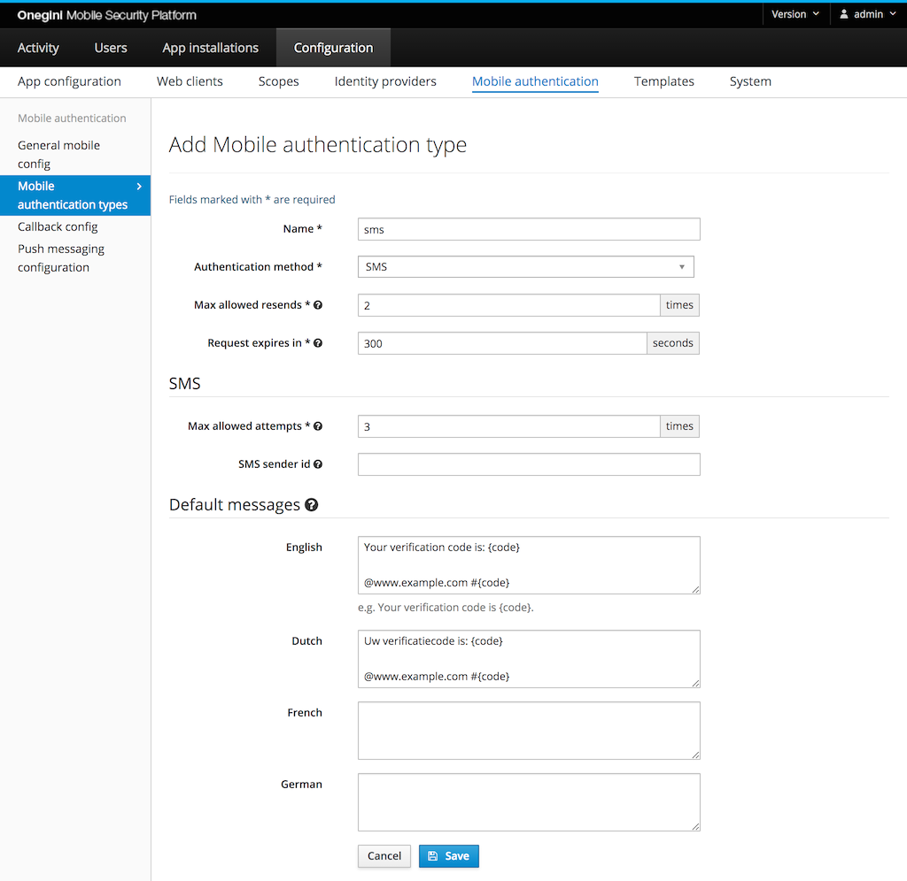
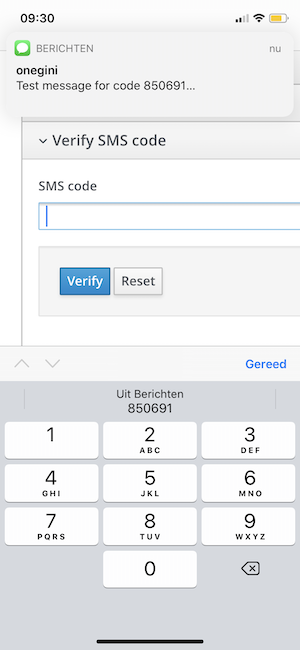

# SMS authentication

## Introduction

For SMS, the end-user does not have to install an app on their mobile device. The website initiates the mobile authentication at Onegini Access
which sends a text message with a code to the end-user. The website then needs to present a screen to the end-user to enter the code that was sent via SMS. When
the end-user has entered the code, the website sends this to Onegini Access which returns the validation result.

## General configuration


Go to the `General` subsection in `General mobile config` section to configure the following options.

The checkbox at `SMS Authentication` / `Authentication enabled` must be checked to allow mobile authentication via SMS. All SMS messages are sent from
a preconfigured phone number. You can override this phone number by entering your own sender id. This can be a phone number, a short code that is
registered with your SMS provider, or an alphanumeric sender id (e.g. your brand name). Not all countries support sending SMS messages from an
alphanumeric sender id, while other countries require to register the sender id up front. When sending the text message fails with this sender id,
Onegini Access tries to send the SMS message from the default phone number.

The enrollment options are not necessary for SMS.

## Mobile authentication type configuration

Go to `Configuration` &rightarrow; `Mobile authentication` &rightarrow; `Mobile authentication types`.



The following fields are required:

* Name: this is used to identify the type when calling the [mobile authentication API](../../../api-reference/mobile-authentication/index.md)
* Authentication method: SMS
* Max allowed resends: the maximum number of times an SMS message with the code can be sent for a single mobile authentication transaction. `0` means that 
resending the SMS message is not allowed.
* Request expires in: the time the user gets to complete the authentication via OTP
* Max allowed attempts: the maximum times a user can enter an incorrect code to validate the transaction. When the user exceeds this limit, the transaction is 
invalidated. `0` means unlimited attempts. It is highly recommended to set a limit.

Optional configuration:

* SMS sender id: Text messages are sent from the phone number that is configured for the SMS provider. You can configure a specific sender per mobile 
authentication type. This can be a phone number, a short code that is registered with your SMS provider, or an alphanumeric sender id (e.g. your brand name). 
Not all countries support sending SMS messages from an alphanumeric sender id, while other countries require to register the sender id up front. Configuring the
sender id per mobile authentication type is optional. When sending the text message fails with the sender id for this mobile authentication type, the 
Onegini Access will retry sending the SMS using the sender id that is configured in as sender id in the [General configuration](#general-configuration). 
When that fails, it tries to send the message using the default phone number for Onegini Access.
* Default messages: per supported language you can preconfigure the message that is sent to the user via SMS. Refer to [SMS message body](#sms-message-body) for
their format.

## SMS message body
With SMS authentication, the end-user will receive a six digit code. This code must be included in the message. This message can be configured up front or sent
with the api request that triggers the mobile authentication. A placeholder must be included to indicate where the code should be inserted in the message.
The placeholder to be used is `{code}`. If the `{code}` placeholder is not included in the message, Onegini Access will only send the code in the text
message and no additional message. 

An example SMS message: `Your example SMS code: {code}`.

Onegini Access is sending SMS for one time codes. There is a (proposed) [standard for sending one time codes](https://github.com/WICG/sms-one-time-codes)
via SMS. Some browsers will suggest using the code that has been sent for that domain. For the autocomplete, the message must end with:

* a newline
* @ plus the host name of the website where the end-user enters the code, e.g. `@www.example.com`
* \# plus the code: `#code` 

```
Your verification code is: {code}

@www.example.com #{code}
```


