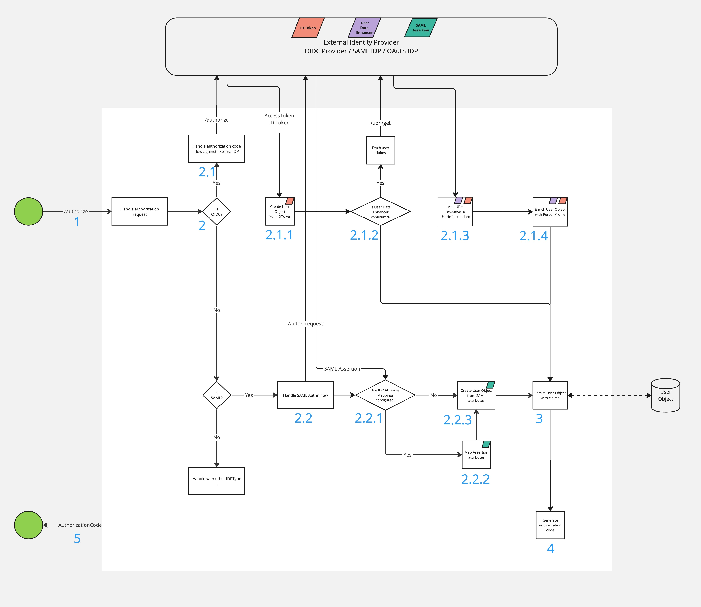
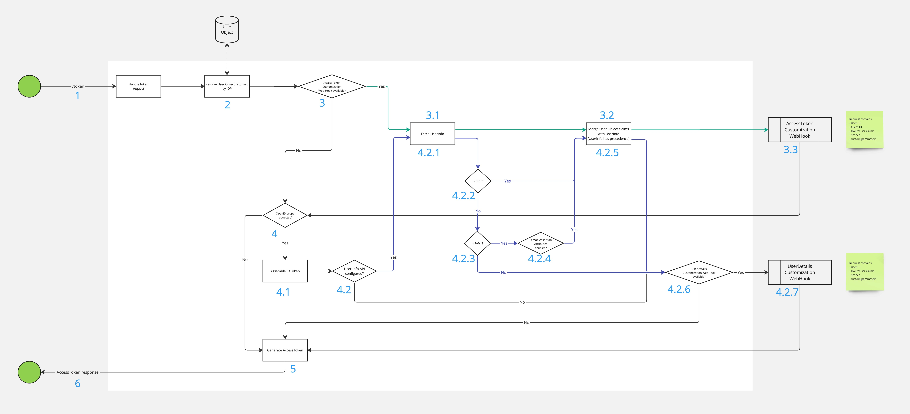

# User claims and attributes lifecycle

This section aims to explain and visualise how Access deals with user claims/attributes during the most commonly used flows.

## Authorization

1. The OAuth Client / OIDC Relying Party initiates the authorisation code flow.
2. Based on the _client_id_ parameter (optionally also _idp_id_), Access resolves the IdentityProvider instance that will be used for user
   authentication.
    1. If the underlying IdentityProvider is of type OIDC (e.g. Tulip), Access redirects the user to the defined OIDC Provider with another
       authorization request.
        1. Once authenticated, the OIDC Provider redirects back to Access with the authorisation code and Access exchanges the code for the
           AccessToken / IDToken pair. The IDToken is the primary source of information about the user. An internal User Object is created
           and populated with all the user claims available in the IDToken. In addition to the user attributes, the AMR and ACR claims are
           also stored in the User Object. _Note_ If the Identity Provider is of type Tulip, Access only reads the AMR and ACR claims from
           the ID Token.
        2. If the IdentityProvider is of type Tulip, it is likely that a User Data Enhancer (UDH) API integration is configured. If this is
           the case, the user claims are requested via another API call from UDH, Access passes the user identifier (subject) and a set of
           scopes requested by the client. Otherwise, the User Object is persisted (see #2.a.5).
        3. The UDH response is mapped to a UserInfo standard format.
        4. The User Object is populated with any claims returned by the UDH service.
    2. If the underlying IdentityProvider is of SAML type (e.g. CIM), Access redirects the user to the defined SAML Identity Provider with
       SAML AuthnRequest (whether it is a redirect or a POST call depends on the integration characteristic).
        1. Access processes the SAML AuthnResponse.
           SAML [Attributes Mapping](https://docs.onewelcome.com/products/access/topics/general-app-config/identity-providers/identity-providers/#attribute-mapping)
           is triggered if any are defined for a given SAML Identity Provider. If no mappings are available all SAML assertion attributes
           are used in the next step.
        2. SAML assertion attributes are mapped to claims according to the configuration. Any unmapped attributes are discarded/filtered
           out.
        3. An internal user object is created and populated with all user claims provided by the SAML assertion. Next to the user
           attributes, the AMR/ACR value is also stored in the User Object.
3. The User Object with all the claims is persisted.
4. The authorization request is considered successful, Access generates the _authorization_code_.
5. The OAuth Client / OIDC Relying Party receives a 302 Redirect with the _authorization_code_ from Access.

## Token

1. The OAuth Client / OIDC Relying Party requests the exchange of the _authorisation_code_ for an Access Token / ID Token.
2. Access resolves a User Object that was persisted during the authorisation code flow.
3. If an Access Token Customisation Web Hook is configured for a requesting OAuth Client/OIDC Relying Party, see [#3.1](#3.1.).
    1. Retrieve user claim from the underlying Identity Provider (depending on the type of Identity Provider, different sources may be
       considered here). If the user claims were fetched during the authorisation code flow, Access will resolve them from an internal
       cache.
    2. The User Object is populated with any claims returned by the User Info API. If a given claim already exists in the User Object, it
       will be overwritten with the claim from the User Info source, which is considered more recent.
    3. [Access Token Customization Web Hook](https://docs.onewelcome.com/products/access/topics/integration-extension/hooks/customize-access-token/customize-access-token-hook/)
       is executed. The hook implementation is provided with all available user information, as well as contextual details about the Access
       Token being created.
4. If the requesting client is of OIDC type and `openid` scope was requested, Access triggers ID Token assembly,
   see [#4.1](#4.1.).
    1. Access starts to assemble all the details needed to generate the ID token, using the internal User Object as the source of the user
       information.
    2. Retrieve user claims from the underlying Identity Provider if available, otherwise see [#4.2.6.](#4.2.6.).
        1. Retrieve user claims from the underlying Identity Provider (depending on the type of Identity Provider, different sources may be
           considered here). If the user claims were fetched during the authorisation code flow, Access will resolve them from an internal
           cache.
        2. Check if the underlying Identity Provider is of type OIDC, otherwise see [#4.2.3.](#4.2.3.).
        3. If the underlying Identity Provider is of type SAML (e.g. CIM), otherwise see [#4.2.6.](#4.2.6.).
        4. If `Map Assertion Attributes` feature toggle is enabled for underlying SAML Identity Provider, otherwise see [#4.2.6.](#4.2.6.).
        5. The User Object is populated with all the claims returned by the User Info API. If a given claim already exists in the User
           Object, it will be overwritten with the claim from the User Info source, which is considered more recent.
        6. If a User Details Customisation Web Hook is configured for a requesting OAuth client/OIDC Relying Party, proceed to
           to [#5](#5.).
        7. [User Details Customization Web Hook](https://docs.onewelcome.com/products/access/topics/integration-extension/hooks/customize-user-details/customize-user-details-hook/)
           is executed. The hook implementation is provided with all available user information, as well as contextual details about the ID
           token being created.
5. Access generates an Access Token and ID Token (if requested).
6. The OAuth Client/OIDC Relying Party receives a token response from Access.
