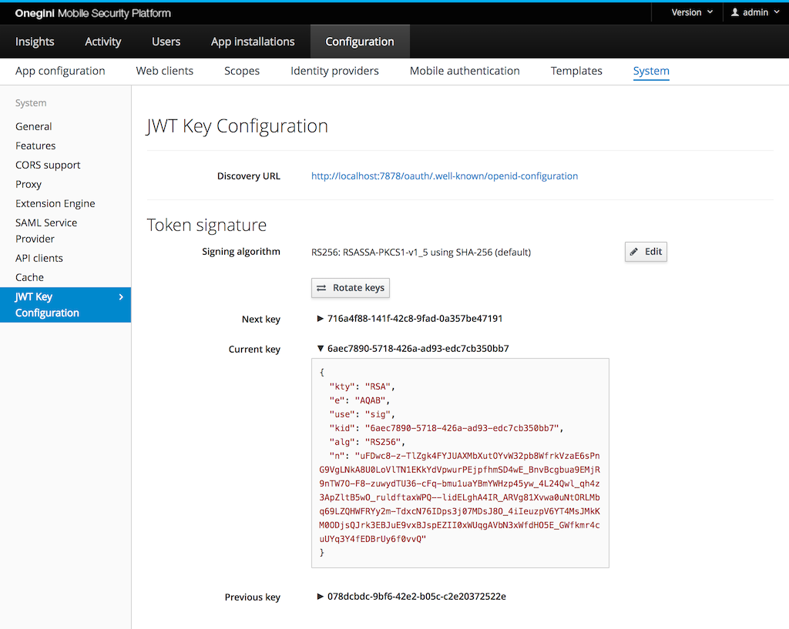
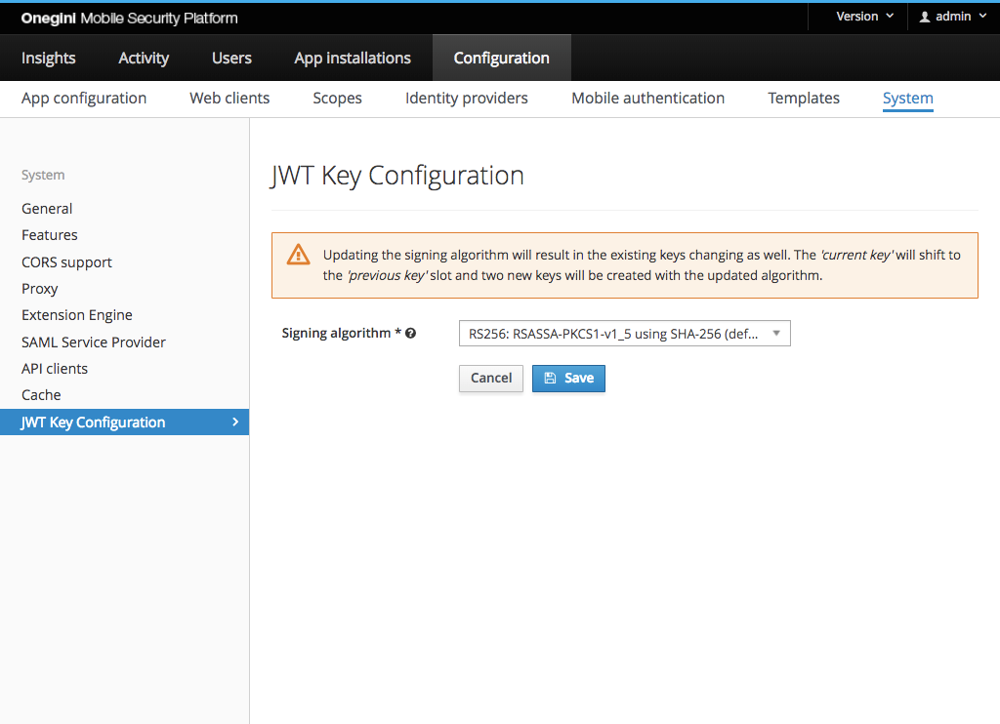
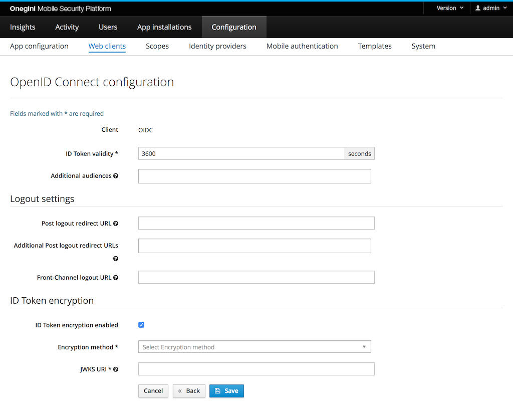

# Configuration

The steps below summarizes how to configure Onegini Access as OpenID Provider.

## Configure JWT Keys for signing
Onegini Access allows to configure the algorithm and keys used for calculating digital signature of the ID Token.



| Field                             | Required  | Example value                                                           | Details
|-----------------------------------|-----------|-------------------------------------------------------------------------|------------------------------------------------------------------------
| Discovery URL                     | Read-only | https://tokenserver.example.com/oauth/.well-known/openid-configuration  | URL to Discovery endpoint
| Signing algorithm                 | Yes       | RS256: RSASSA-PKCS1-v1_5 using SHA-256 (default)                        | The algorithm used for generating digital signature in JWT
| Next key                          | Read-only | db5aac2e-504b-4845-8900-4d64d2afd3ad                                    | Identifier of the `Next key`
| Current key                       | Read-only | 59b04937-7a12-4ff7-9d27-67b55637da9f                                    | Identifier of the `Current key`. This is the identifier referenced in `KID` field of the currently issued ID Tokens.
| Previous key                      | Read-only | a1328084-d75d-4ea7-a734-fe5257a5faff                                    | Identifier of the `Previous key`. This field is empty upon initial creation of the keys.

The `Next key` and `Current key` are generated during initial application startup.

For security reasons it is advised to periodically change the keys used for the digital signature. To ensure that the Relying Party 
is able to validate the signature of the ID Tokens issued prior to key change, Onegini Access provides the following key rotation mechanism:
upon clicking `Rotate Keys` button, the `Current key` becomes the `Previous key`, the `Next key` becomes the `Current key` and a new `Next key`
is generated.

When modifying the algorithm, it requires the change of the underlying keys. As part of the change, the keys are rotated in a slightly 
different way: the `Current key` becomes the `Previous key` and two new keys are generated - the `Current key` and the `Next key`.



For those algorithms that make use of RSA key it is possible to configure the strength of the key using following property:

```
TOKEN_SERVER_ADMIN_RSA_ENCRYPTION_STRENGTH=2048
```

The minimum RSA strength is 2048 bits.

## Web Client

A [web client](../../web-clients/index.md) becomes an OpenID Relying Party with the following [web client configuration](../../web-clients/web-client-configuration.md):  

* Add the grant type `Authorization Code`.
* Add the scope `openid` to either the `Default Scopes` or `Additional Scopes`.

Then configure OpenID specific settings as described in [OpenID Connect Relying Party configuration](#openid-connect-relying-party-configuration).

## Mobile applications

All [mobile applications](../../mobile-apps/index.md) are an OpenID Relying Party. When [creating a mobile application](../../mobile-apps/app-configuration/app-configuration.md),
 the scope `openid` is automatically added to the `Default scopes`.

## OpenID Connect Relying Party configuration

Besides the configuration of web clients and mobile applications, there's a page for the OpenID Connect Relying Party specific configuration. This configuration
contains the following items: 



| Field                                 | Required | Example value                                  | Details
|---------------------------------------|----------|------------------------------------------------|---------------------------------------------------------------------------------------------------------------------------------------------------------------------------------------------
| ID Token validity                     | yes      | 3600                                           | Number of seconds an ID Token is valid. It is used to calculate the `exp` expiration date claim in the ID Token.
| Additional Audiences                  | no       | https://resource.example.com                   | A list of case sensitive strings that identify the intended audience of the issued ID Token. It is used to populate `aud` claim in the ID Token in combination with the `Client ID` which is always included.
| Delete access/refresh tokens on logout| no       |                                                | When enabled, access tokens and refresh tokens will be deleted when the [End-session endpoint](../session-management/end-session-guide.md) is called. It is advised to use this when using the client authentication method `PKCE`. Note: If a client enables [SAML SLO](../../technical-app-management/idp-saml-sp-config/idp-saml-sp-config.md#slo-enabled) and does not use refresh tokens, the tokens will be removed regardless of this setting.
| Post Logout Redirect URL              | no       | https://redirect.example.com                   | This is Primary/Default Post Logout URL. The user will be redirected to this URL if no other URL is specified in the end session request.
| Additional Post Logout Redirect URLs  | no       | https://redirect.example.com, https://postlogout.example.com   | A list of additional Post Logout Redirect URLs. This list contains the potential URLs that could be specified to be redirected to as part of the end session request.
| Front-Channel Logout URL              | no       | https://frontchannellogout.example.com         | A URL reachable on the Relying Party that will invalidate the session. This will be triggered after a successful logout via the end session page.
| ID Token Encryption enabled           | no       |                                                | Enabling/Disabling ID Token encryption
| Encryption Method                     | depends  | A256GCM                                        | The encryption method that is used to encrypt the ID Token. Required when `ID token Encryption Enabled` is checked.
| JWKS URI                              | depends  | https://example.com/jwks.json                  | JSON Web Key Set (JWKS) endpoint which contains JSON Web Keys (JWK) used to encrypt the ID Token. Required when `ID Token Encryption enabled` is checked.

For additional information on the use of the Redirect and Front Channel URLs, refer to the [end session guide](../session-management/end-session-guide.md)

## Identity Provider
A Relying Party may request additional claims as specified in [OpenID Connect scopes](../overview/scopes-and-claims.md).
To enable Onegini Access capability to retrieve this information, it is required to enable User Info as described in
[Configure User Info Endpoint](../../general-app-config/identity-providers/identity-providers.md#configure-user-info-endpoint) for the Identity Provider associated
with the Relying Party.