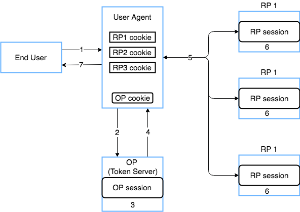

# End Session Guide

This guide covers configuration and expected flows for the [End Session API](../../../api-reference/oidc/session-management/end-session.md) which is located 
in the [OpenID Connect configuration](../../web-clients/web-client-configuration.md#enabling-openid-connect-capability).

## Configuration

### Delete access/refresh tokens on logout
When enabled, This will delete any access tokens and refresh tokens for a given session when the End-Session endpoint is called. It is advised to use this when
using the client authentication method `PKCE`. Note: If a client enables [SAML SLO](../../technical-app-management/idp-saml-sp-config/idp-saml-sp-config.md#slo-enabled)
and does not use refresh tokens, the tokens will be removed regardless of this setting.

### Post Logout Redirect URIs

After hitting the end session endpoint, you most likely would like your RP to be redirected back to one of your own pages. You can configure one 
primary/default URI and many additional URIs that you will allow the OP to redirect the RP to. When making a request to the endpoint, you can specify a
`post_logout_redirecturi` as part of your request but it must match one of the configured urls in the OpenID Client Configuration. If no URI is specified in the
request, it will fallback to the default or not redirect at all if nothing is configured.

## Front-Channel Logout support

Onegini's OP implementation also has support for [OpenID Connect Front-Channel Logout 1.0](https://openid.net/specs/openid-connect-frontchannel-1_0.html). You
can configure a Front-Channel logout URI in the admin console. This URI will be included in the end session html as an iFrame that will execute a
`GET` request towards a particular URI. This is most commonly used to help with Single Logout (SLO) in the Relying Party's application(s).

## Flow diagram

  
_RP logout + Front Channel (3 Relying Parties)_

The steps described below occur only once the session has already been established at the RP and OP.

1. End user wishes to logout and clicks a logout link for RP1 (or any of them).
2. User agent triggers the end session url on the OP
    * It should be triggered with at least an `id_token_hint` and optionally a `post_logout_redirect_uri`. It should be included if the User
      Agent wishes to redirect to a specific URI after a successful logout.
3. OP invalidates its own session which links to all three RP's in it.
4. OP generates a logout page that contains an iFrame for each RP that was in that particular session and returns it to the User Agent.
5. User Agent renders the logout page which triggers requests to the RPs to invalidate the sessions. RP's should have a reachable URIs which
   trigger an end in the session on the RP.
6. Each RP receives the request independently, destroys its own session, and clean up cookies/storage
7. User Agent displays a successfully logged out page or has redirected to another page based on the `post_logout_redirect_uri` that was
   specified in step 1.

To see an example of the html, refer to the [End Session API](../../../api-reference/oidc/session-management/end-session.md#front-channel-logout-support).
