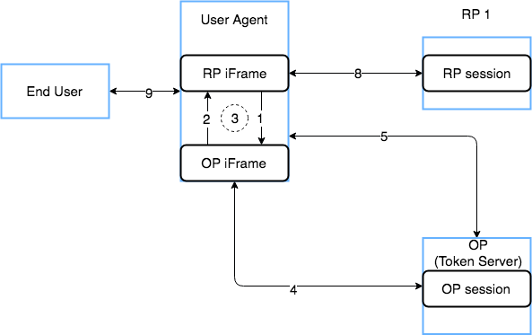

# Iframe Session Monitoring

This guide is designed to help you implement the Relying Party (RP) side of Session Management using two iframes.

## Explanation

At the core of it, there should be two iframes included on your website's html page that are communicating back and forth to determine if the session state has
changed. If it detects a change, the RP will need to make an Authentication request with the request parameter `prompt=none` to determine if the user is still
logged in. You can read the specification in further detail about [Session Status Change Notification](https://openid.net/specs/openid-connect-session-1_0.html#ChangeNotification).

## Diagram of the flow


The steps described below will occur once the session has already been established at the RP and OP.

1. RP iframe calls postMessage() which sends data to the OP iframe to check the session state.
2. OP iframe will respond `changed`, `unchanged`, `error` depending on the current state. (OP browser state matches what is expected)
3. Steps 1 and 2 will occur at a given interval to continue monitoring session.
4. When the session on the OP ends either via timeout or some user action, the state is changed to reflect it. (OP browser state is updated)
5. Meanwhile, the RP iframe has continued to repeat step 1 and 2 and it will detect that something has changed.
6. RP makes an Authentication request with `prompt=none` to the OP to determine if they are still authenticated.
7. If so, the RP should store the new `session_state` and `id_token` values.
8. If Step 6 results in a `login_required` error, RP should invalidate the RP session in their application, clear any local storage (idToken, session_state).
9. End user notified of logout

This scenario also supports multiple RP's that exist within the same User Agent that share an OP as the session can be valid for multiple RPs simultaneously. If one logs out, the checkStatus interval will trigger the other to also log out.

## Implementation as the Relying Party

You will need to embed the two iframes into your pages to monitor the session state of your users. OneWelcome as the OP, has provided an endpoint to get the html
for the OP iframe. It is located at `/oauth/v1/checksession` of the OP server. You can see an example of the html with comments in
[OpenID Provider iframe](../../../api-reference/oidc/session-management/check-session.md). The RP iframe is responsible for calling the `postMessage` function
of the OP iframe with the necessary arguments.

### Getting session_state from the Authentication Request

**Example query string response on Authorization endpoint**

```
?scope=openid&session_state=e25f178e1642c58da7be3d2066a546684bd6b8e4012ded2321d66bbe3e01b5f4.726095b8a2a71a7886c95496bf3910dc7ab374343eeef3e36e871cbee9360e71
```

When making the authentication request to the OP, a `session_state` value will be returned on the Authorization endpoint. The RP should first validate
the ID Token that is returned and if valid, store the `session_state` value from the query string. It should be stored so that the javascript in the RP iframe is
able to access it. It will need to send it to the OP iframe as part of checking the session state.

Read more about [creating and updating sessions](https://openid.net/specs/openid-connect-session-1_0.html#CreatingUpdatingSessions).

#### Session State in a cookie

Using a cookie to store the session state value is probably the most common approach, but it should be named uniquely to avoid being overwritten.
If the `session_state` value is modified locally, it will trigger a status change resulting in network traffic as it is directly coupled to the browser
state in the OP. Cookies are shared on a per domain basis so take extra care if you wish to host multiple RPs on a single domain.

### Relying Party iframe

A Relying Party iframe will need to be created to communicate with the OP iframe. Refer to our [example implementation](relying-party-iframe.md) with some
comments to help with the implementation.

### Putting the two iframes together

Once the RP iframe has been implemented, it is as simple as including both on a page that is authenticated.

**Sample HTML for including both:**

```html
<iframe id="rpif" style="width:0;height:0;border: 0;border: none;position:absolute;" src="https://RPserver.example.com/rpiframe"></iframe>
<iframe id="opif" style="width:0;height:0;border: 0;border: none;position:absolute;" src="https://oneginiOPServer.example.com/oauth/v1/checksession'}"></iframe>
```

## Restrictions

### Identity Providers
OneWelcome Access requires OneWelcome CIM or any other SAML identity provider to determine if the user is still authenticated. For a
JavaScript client that utilizes the authorization code flow with PKCE, you must use the SAML artifact binding. For server side Relying Party implementations you
can also use the SAML redirect or post binding.
When a different type of identity provider is used, OneWelcome Access will always respond with the error `login_required`.

### Hosts and cookies
The request towards OneWelcome Access requires a cookie to determine the session. Browsers are no longer always sending cookies to servers to protect the
privacy of their users. The request to check the session with the OP is done via an iframe, and this has brought restrictions to the setup. Some browsers will
only send cookies to the OP when it shares the domain name with the RP and only via https.

When the RP is accessed on `https://www.example.com`, the OP must use a host name that ends with `example.com`. Browsers will send the cookies to
`https://oneginiOPServer.example.com`, but not to `https://oneginiOPServer.example.net`.

### Blocked iframes
If you are experiencing errors in the browser about the RP iframe when testing, you may need to tweak the
[X-Frame-Options](https://developer.mozilla.org/en-US/docs/Web/HTTP/Headers/X-Frame-Options) header in your application to allow `same-origin` when serving an
iframe from your own domain.

If your RP sends a [Content-Security-Policy](https://developer.mozilla.org/en-US/docs/Web/HTTP/Headers/Content-Security-Policy) response header, it must allow
iframes on its own host the host of the OP.
