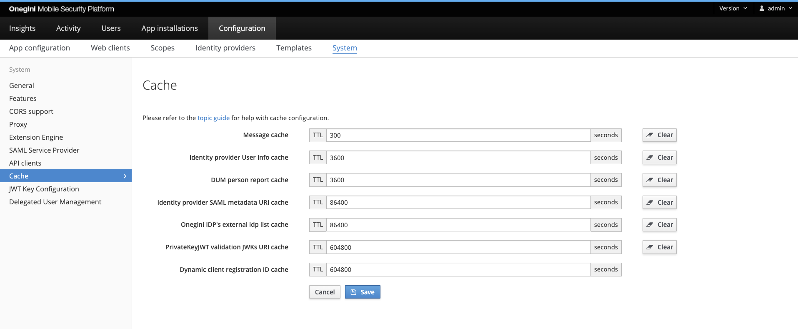

# Cache Configuration

In order to configure Onegini Access Engine cache time to live, go to the `Configuration` section of the administration console, then `System` and choose the `Cache` tab.

The picture below shows the `Cache` view in the Admin Console with an example configuration.

The table below describes the cache properties that can be configured.

>**Note:** Changes to the TTL values will only affect new entries. The TTL values of existing entries will not be updated.

| Cache name                                  | Default | Description                                                                                                                                                | Note                                                                                                                                                                                                     |
|---------------------------------------------|---------|------------------------------------------------------------------------------------------------------------------------------------------------------------|----------------------------------------------------------------------------------------------------------------------------------------------------------------------------------------------------------|
| Mobile authentication                       | 300     | Time to live in seconds for the mobile authentication cache.                                                                                               |                                                                                                                                                                                                          |
| SAML SLO cache                              | 300     | Time to live in seconds after which the SAML session will be terminated and the all session belongings (access tokens and access grants) will be revoked.  | This field is available in the form if the [SAML Service Provider Configuration `SLO enabled`](../../technical-app-management/idp-saml-sp-config/idp-saml-sp-config.md#slo-enabled) is enabled.          |
| Static resources cache                      | 604800  | Time to live in seconds for the i18n message cache and templates.                                                                                                        |                                                                                                                                                                                                          |
| Identity Provider User Info cache           | 3600    | Time to live in seconds for user identity cache.                                                                                                           | The user identity cache is used in OpenID Connect flows only.                                                                                                                                            |
| Identity provider SAML metadata URI cache   | 86400   | Time to live in seconds for the SAML identity provider metadata uri cache.                                                                                 | This will determine how often the metadata will be fetched from the SAML Identity Provider if it is configured to use the Metadata URI.                                                                  |
| Geolocation service                         | 86400   | Time to live in seconds for the geolocation service cache.                                                                                                 | This will determine how often the same IP address and user-agent should be checked in the external service.                                                                                              |
| PrivateKeyJWT validation JWKs URI cache     | 604800  | Time to live in seconds for the JWKs URI response cache.                                                                                                   | This will determine how much time the JWK Set returned by a JWKs URI configured for a given client will be cached.                                                                                       |
| Dynamic client registration ID cache        | 604800  | Time to live in seconds for the dynamic client registration request id.                                                                                    | This will determine how much time the device registration id is kept between Dynamic Client Registration challenge and response. It minimizes probability of reusing the same UUID values.               |                                                                             

## Clearing Cache

The Admin console has the ability to clear certain caches to speed up testing. Caches related to sessions or transactions are not clearable as it may affect 
active users of the system.

Clicking the `Clear` button for a specific cache will clear it asynchronously in Redis.
