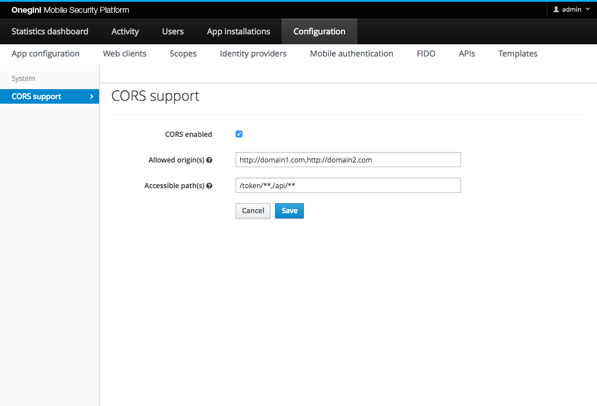

# CORS support

Cross-Origin Resource Sharing ([CORS](https://developer.mozilla.org/en-US/docs/Web/HTTP/CORS)) is an HTTP-header based mechanism that allows a server to
indicate any other origins (domain, scheme, or port) than its own from which a browser should permit loading of resources. In OneWelcome Access you can configure
CORS.

## Configure CORS support

In order to configure CORS, go to the `Configuration` section of the administration console, then `System` and click the `CORS support` tab.

The picture below shows the `CORS support` view in Admin Console with example configuration.

### Enable CORS support

Enable CORS support by checking the `CORS enabled` checkbox.

### Specify allowed origins

In order to allow certain domains to access OneWelcome Access you need to fill the `Allowed origin(s)` field.

**Origin** - The unique combination of a scheme and domain (or hostname and port) combined as `scheme://hostname` (or `scheme://hostname:port`)

You can specify one or more origins, each separated with a comma.

> **Note:** If you leave this field empty, while CORS support is enabled, all origins will be allowed to access the endpoints of OneWelcome Access. This is not recommended for security reasons.

### Specify paths which be accessible from external origins

In order to make certain OneWelcome Access endpoints accessible by (configured) external origins, you need to fill the `Accessible path(s)`.

You can specify one or more origins, each separated with a comma. Exact path mapping URIs (such as `/revoke`) are supported as well as Ant-style path patterns (
such as `/api/**`).

> **Note:** If you leave this field empty, while CORS support is enabled, all endpoints will be possible to access by (configured) origins.

### Disable CORS support

In order to disable CORS support feature you need to uncheck `CORS enabled`.
