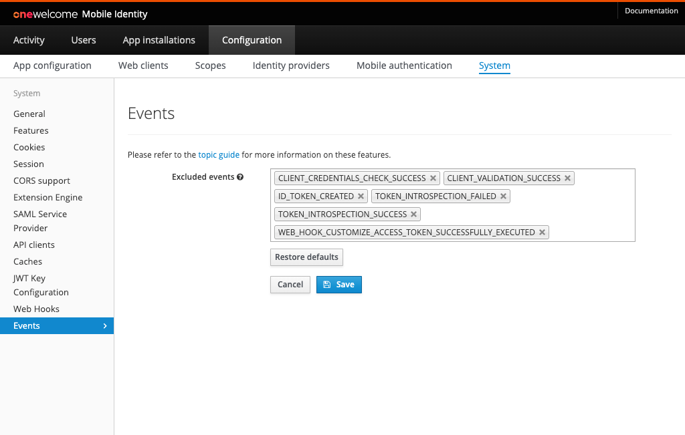

# Events

In order to configure Onegini Access events, go to the `Configuration` section of the administration console, then `System` and choose
the `Events` tab.

The picture below shows the `Events` view in the Admin Console with an example configuration.

## Excluded events

In the `Excluded events` form, the Administrator can select which System event types should be excluded from persisting in the database.
Excluded events will not be stored in the database and will not be visible on the `Activity` page.
Five event types were selected to be excluded by default. However, the system administrator can re-enable them.

> **Note:**  The excluded events will not be stored in the database. However, they will still be sent to AWS by the OneSee (Simple Event Exporter).

