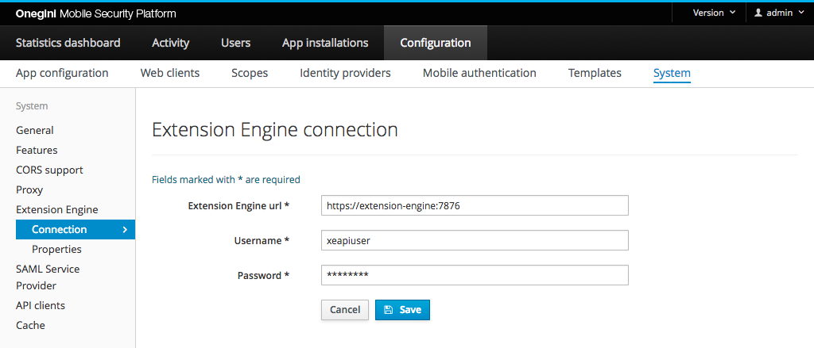

# Onegini Extension Engine connection

Onegini Access communicates via HTTP(S) with the Onegini Extension Engine. The API is used to configure and execute the scripts of [Custom Authenticators](../../custom-authenticators/index.md). You can configure the connection to the Onegini Extension Engine via the Admin Console of Onegini Access.

Go to `Configuration` → `System` → `Extension Engine` → `Connection` to configure the connection to the Onegini Extension Engine.

The picture below shows the page to configure the Onegini Extension Engine connection in the Admin Console with example values.

## Properties

| Field name            | Example                         | Required | Description                                           |
|-----------------------|---------------------------------|----------|-------------------------------------------------------|
| Extension Engine url  | `https://extension-engine:7876` | Yes      | URL of the Onegini Extension Engine                           |
| Username              | xeapiuser                       | Yes      | Username to execute API calls to the Onegini Extension Engine |
| Password              | ThisIsAS3cr3t!                  | Yes      | Password to execute API calls to the Onegini Extension Engine |

## Caching

This configuration is cached in Onegini Access Engine Application. Saving it will also update the cache.
