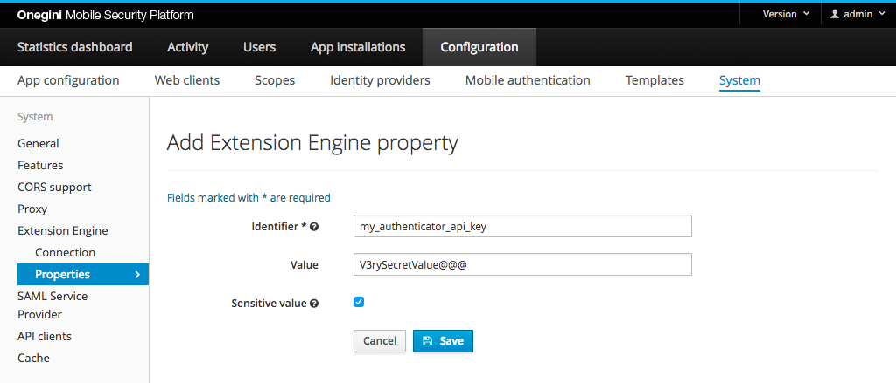

# OneWelcome Extension Engine properties

The scripts in the OneWelcome Extension Engine can contain properties that are specific for an environment or values that the script developer should not know. Examples are the URLs of third party APIs and their credentials. You can configure these properties via the Admin Console of OneWelcome Access.

Go to `Configuration` → `System` → `Extension Engine` → `Properties`. This shows an overview of all the properties in the OneWelcome Extension Engine. Values are masked with `********` in the Admin Console when they contain sensitive data. It is recommended to flag values as sensitive when they contain a password, API key or any other value that should not be shown on the screen after they have been saved.

The picture below shows the page to configure the OneWelcome Extension Engine properties in the Admin Console with example values.

## Properties

| Field name       | Example                  | Required             | Description                                                               |
|------------------|--------------------------|----------------------|---------------------------------------------------------------------------|
| Identifier       | my_authenticator_api_key | Yes                  | The identifier of the property by which the script can access it.         |
| Property value   | V3rySecretValue@@@       | For sensitive values | The value of the property.                                                |
| Sensitive value  |                          | No                   | Flag to indicate whether the value should be hidden in the Admin Console. |
