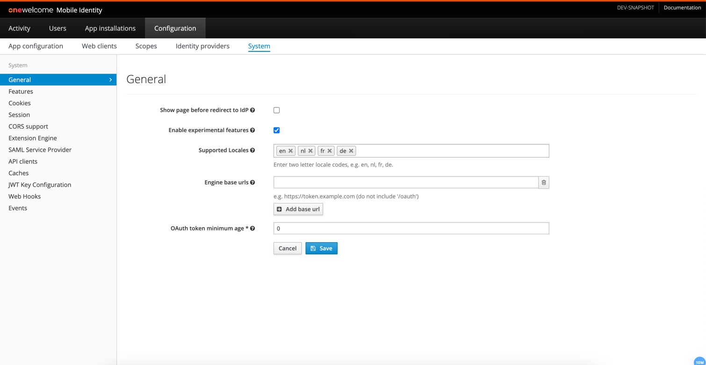

# General system properties configuration

In order to configure OneWelcome Access general properties, go to the `Configuration` section of the administration console, then `System` and choose the `General` tab.

The picture below shows the `General` view in the Admin Console with an example configuration.

The table below describes the general properties that can be configured.

| Field name                                      | Default | Description                                                                                                                                                                            
|-------------------------------------------------|---------|----------------------------------------------------------------------------------------------------------------------------------------------------------------------------------------
| Show page before redirect to IdP                | false   | During the authentication the end user is sent from the authorization endpoint to an endpoint that is specific for that type of identity provider. The default behaviour is to use an HTTP redirect. When checked, an intermediary page will be shown instead.
| Supported Locales                               |         | List of supported locales for which the application will attempt to load the translations. This configuration affects Access Admin and Mobile Authentication messages.
| Engine Base Urls                                |         | These urls will be selectable when exporting the app configuration. They will also be used to show example URLs in a few different places in the admin console.
