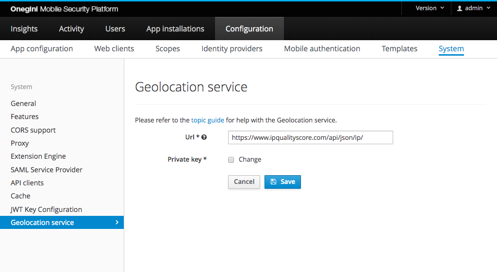

# Geolocation service

The geolocation service is an external service Onegini Access uses to detect the browser and the user location based on the ip address
and `User-agent` http header. It is currently only used during mobile authentication to give 
[additional contextual](../../mobile-apps/mobile-authentication/mobile-authentication.md#adding-additional-context-to-the-secure-message) information to your 
users.

## Configuration
In order to configure the geolocation service, you must first enable it on the [Features](../system-features-config/system-features-config.md) tab.
Once it is enabled, a new tab called `Geolocation service` will appear where further configuration is required.

The table below describes the properties that need to be configured.

| Field name                      | Default                                        | Description                                                                                                                                                                            |
|---------------------------------|------------------------------------------------|----------------------------------------------------------------------------------------------------------------------------------------------------|
| Url                             | `https://www.ipqualityscore.com/api/json/ip/`  | The Url to an external service endpoint that provides geolocation data. Currently Onegini Access only supports IpQualityScore.
| Private key                     |                                                | The Private key obtained during registration with IpQualityScore.

## Cache
To limit the amount of actual calls to the external service, the queries are cached with [a configurable TTL](../cache-config/cache-config.md).
