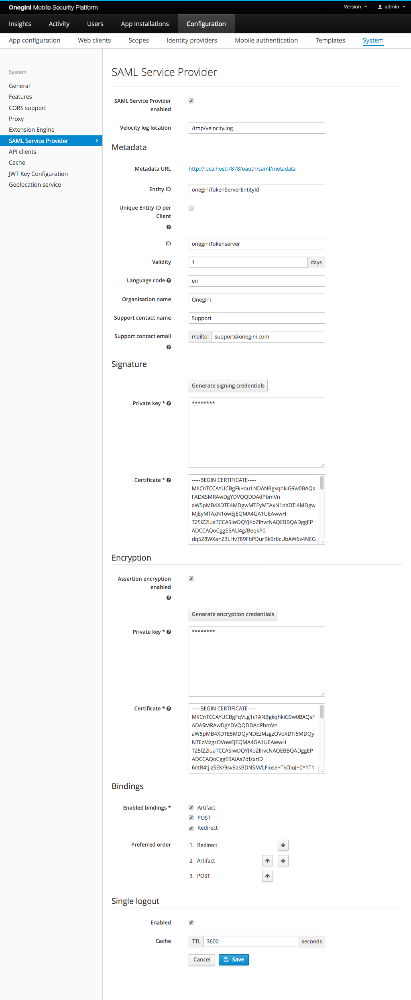

# SAML Service Provider Configuration

OneWelcome Access can act as a SAML Service Provider during the authentication of a user, for this reason OneWelcome Access exposes metadata. The SAML metadata exposed by OneWelcome Access at the [metadata URL](#metadata-url). This section describes how to adapt the values used in the metadata for this Service Provider.

In order to configure SAML Service provider usage, go to the `Configuration` section of the administration console, then `System` and choose the `SAML Service provider` tab.

The picture below shows the `SAML Service provider` view in the Admin Console with an example configuration.



## Configure location of the SAML velocity log file

In order to configure location of the SAML velocity log file set the following field:

| Field name            | Default value     | Description                                                                                          |
|-----------------------|-------------------|------------------------------------------------------------------------------------------------------|
| Velocity log location | /tmp/velocity.log | Location on the file system where the velocity log file generated by the SAML module will be stored. |

>**Note:** Applying this value change requires a restart of OneWelcome Access Engine Application.

## Configure Metadata of the SAML Service Provider

In order to configure Metadata for the SAML Service Provider configure the following fields:

| Field name                                                 | Default value              | Description                                                                                                                                                                      |
|------------------------------------------------------------|----------------------------|----------------------------------------------------------------------------------------------------------------------------------------------------------------------------------|
| <a id="saml-enabled"></a>SAML Service Provider enabled     | true                       | Indicates if SAML endpoints on OneWelcome Access are enabled. Without enabling these endpoints the samlUserAuthenticator can not be used.                                         |
| Entity ID                                                  | oneginiTokenServerEntityId | Entity identifier of the SAML Service Provider.                                                                                                                                  |
| Unique Entity ID per Client                                | false                      | When enabled, an identifier will be appended to the previously defined 'entityId' on a per mobile app/web client basis. The metadata endpoint changes to include the identifier. The identifier is case sensitive. |
| ID                                                         | oneginiTokenServer         | Identifier of the SAML Service Provider.                                                                                                                                         |
| Validity                                                   | 1                          | Indicates the validity of the SAML metadata of the Service Provider in days.                                                                                                     |
| Language                                                   | en                         | Language code used in the descriptions etc in the SAML Service Provider metadata.                                                                                                |
| Organisation name                                          | Onegini                    | Name of the organisation used in the SAML Service Provider metadata.                                                                                                             |
| Support contact name                                       | Support                    | Name of the support contact person used in the SAML Service Provider metadata.                                                                                                   |
| Support contact email                                      | support@onegini.com        | The e-mail address belonging to the contact person in the SAML Service Provider metadata.                                                               |


## Metadata URL

| Metadata URL                         | Unique Entity ID per Client enabled|
|--------------------------------------|------------------------------------|
| `/oauth/saml/metadata`               | `false` (default)                  |
| `/oauth/saml/{identifier}/metadata`  | `true`                             |

By default the URL is `/oauth/saml/metadata`. If `Unique Entity ID per Client` is enabled, the aforementioned URL will not work. It needs 
to include an additional identifier. For mobile applications, it is the application identifier. For web clients, it is the Client ID. Here is the defined URL for
an application with the identifier `oneginiExampleApp`: `/oauth/saml/oneginiExampleApp/metadata`. The identifier is case sensitive.

The generated metadata XML will include the entityId, a dash, and the client identifier. So if the base `EntityID` is defined as `exampleEntityId` and you are
looking at the SAML metadata for an application with an identifier `oneginiExampleApp`, the combined entityId in the XML will be `exampleEntityId-oneginiExampleApp`.
```xml
<md:EntityDescriptor xmlns:md="urn:oasis:names:tc:SAML:2.0:metadata" ID="someId" entityID="exampleEntityId-oneginiExampleApp" validUntil="2018-05-11T13:27:07.028Z">
...
</md:EntityDescriptor>

```

## Configure SAML requests signing

In order to configure SAML requests signing set the following fields:

| Field name          | Required | Format                                                                                                                       | Default value         | Description                                                                                                       |
|---------------------|----------|------------------------------------------------------------------------------------------------------------------------------|-----------------------|-------------------------------------------------------------------------------------------------------------------|
| Private key         | yes      | PEM encoded [PKCS #1](https://tools.ietf.org/html/rfc8017) or [PKCS #8](https://tools.ietf.org/html/rfc5208) RSA Private Key | empty                 | The private key used by the SAML Service Provider to sign requests.                                               |
| Certificate         | yes      | PEM encoded X.509 certificate                                                                                                | empty                 | The certificate of the SAML Service Provider which can be used by the IDP to validate the signature.         |

The code snippet below generates PKCS #1 and associated certificate using OpenSSL:
```
openssl genrsa -out prv-pkcs1.pem 2048
openssl req -new -x509 -key prv-pkcs1.pem -out x509-cert.pem
```

The code snippet below generates PKCS #8 and associated certificate using OpenSSL:
```
openssl genpkey -out prv-pkcs8.pem -algorithm RSA -pkeyopt rsa_keygen_bits:2048
openssl req -new -x509 -key prv-pkcs8.pem -out x509-cert.pem
```

For convenience the private key and the certificate can be also generated by OneWelcome Access using `Generate signing credentials` button.

## Configure SAML Assertion Encryption

When OneWelcome Access is acting as a SAML Service Provider, it may advertise additional public keys which can be used afterwards by an external SAML Identity Provider to encrypt the Assertion.
Since the SAML Assertion carries user specific sensitive information, we advise you to enable the Assertion encryption functionality to keep that data safe.

| Field name                           | Required                  | Format                                                                                                                                   | Default value         | Description                                                                                                      |
|--------------------------------------|---------------------------|------------------------------------------------------------------------------------------------------------------------------------------|-----------------------|------------------------------------------------------------------------------------------------------------------|
| Assertion encryption enabled         | no                        | -                                                                                                                                        | empty                 | Enables/disables SAML Assertion Encryption functionality.                                                        |
| Private key                          | yes if encryption enabled | PEM encoded [PKCS #1](https://tools.ietf.org/html/rfc8017) or [PKCS #8](https://tools.ietf.org/html/rfc5208) RSA Private Key             | empty                 | The private key used by the SAML Service Provider to decrypt assertions returned by the SAML Identity Provider.  |
| Certificate                          | yes if encryption enabled | PEM encoded X.509 certificate                                                                                                            | empty                 | The public key / certificate of the SAML Service Provider which can be used by the IDP to encrypt the assertion. |

## Configure SAML binding

By default OneWelcome Access uses the following order to resolve the SAML binding during authentication:

1. Artifact
2. POST
3. Redirect

There may be reasons to disable certain bindings or change the preferred order for choosing a binding. For example when both OneWelcome Access and the SAML 
identity provider do support Artifact binding but cannot communicate with each other due to network restrictions.

| Field name          | Required  | Default value            | Description                                                                                     |
|---------------------|-----------|--------------------------|-------------------------------------------------------------------------------------------------|
| Enabled bindings    | yes       | Artifact, POST, Redirect | Enables/disables SAML bindings for authentication                                               |
| Preferred order     | no        | Artifact, POST, Redirect | Changes the order in which the enabled SAML bindings are resolved during authentication         | 

## Configure Single logout (SLO) feature

The goal of the Single logout (SLO) feature is to logout user from a web client when their SAML session is terminated by the SAML Identity Provider. In order to configure using SLO configure the following fields:

| Field name                                          | Default value | Description                                                                                                                                        |
|-----------------------------------------------------|---------------|----------------------------------------------------------------------------------------------------------------------------------------------------|
| <a id="slo-enabled"></a>Enabled                     | false         | Indicates if Single Logout feature is enabled. When enabled, SAML IdP can be configured to be able to terminate sessions at OneWelcome Access.      |
| Cache                                               | 3600          | The time to live after which the SAML session will be terminated and the all session belongings (access tokens and access grants) will be revoked. |