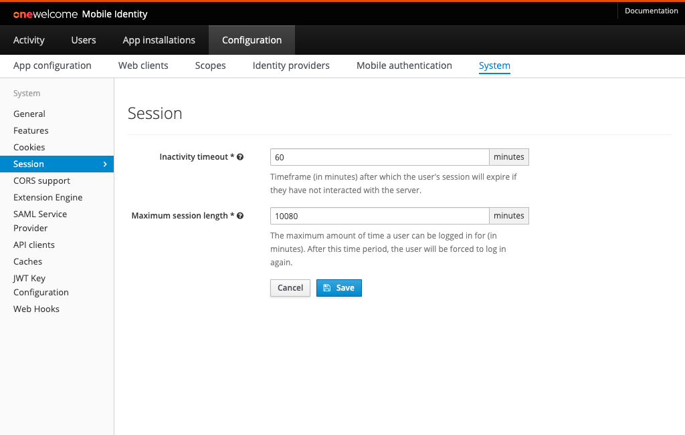

# Session Configuration

## Configuration

Go to the `Configuration` section of the administration console, then `System` and click the `Session` tab.

The picture below shows the `Session` view in Admin Console with example configuration.

### Inactivity timeout
This value controls how long a user's session stays active before expiring if they have not interacted with the system. Each interaction
with the system will elongate the session by this configured amount.

### Maximum session length
The maximum amount of time a user can be logged in for (in minutes). After this time period, the user will be forced to log in again.

## Updates
After updating these values, it will only affect new sessions or sessions that have been updated _after_ the values have been saved. It 
will not force expiration of existing sessions which have not been interacted with/updated.