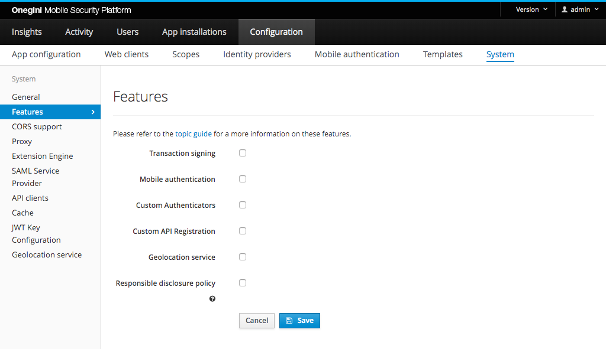

# Configure system features

Onegini Access has several features that can be disabled on system level. When a feature is disabled on system level functional configuration options in the 
admin console for the feature are no longer available. Any existing functional configuration will remain but will be inactive. So when you temporary disable a 
feature on system level and you enable it again later, the original configuration will be available again.

In order to configure features on system level, go to the `Configuration` section of the administration console, then `System` and 
click the `Features` tab.

Features that can be enabled/disabled via this mechanism:

- [Transaction signing](../../mobile-apps/transaction-signing/transaction-signing.md)
- [Mobile authentication](../../mobile-apps/mobile-authentication/mobile-authentication.md)
- Geolocation for mobile authentication
- [Custom authenticators](../../custom-authenticators/index.md)
- [Custom API Registration](../../custom-registration/index.md)
- [Responsible disclosure policy](../../../appendix/responsible-disclosure-policy.md)

