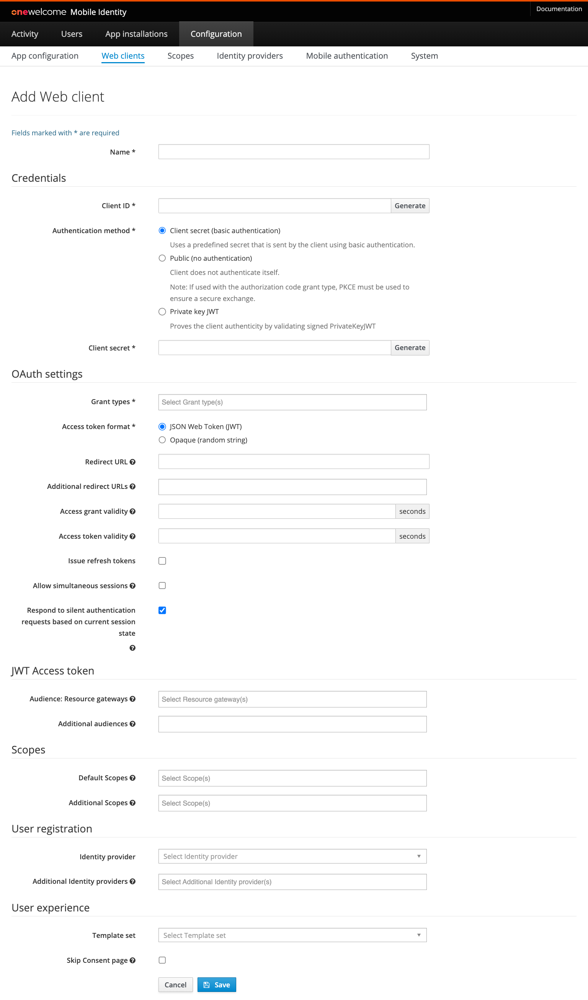

# Web client configuration

Web clients are often websites or portals that run on a server and use OAuth for authentication.
They may also be used for standalone applications installed on end user computers if they require OAuth authorization.
They need to be configured via the admin console. This section describes the steps related to configuration of these web clients.

## Creating a Web Client

In order to create a new web client, Go to the `Configuration` tab of the administration console and click the `Web Clients` tab.
On the overview that is shown you can see all the existing web clients.

!!! Note

    **Web clients** are meant for web servers or fat clients. In this case you or a trusted party is managing the hardware on which this web client runs.
    We also reference these as static OAuth clients.

To add a new web client, click on the add button. The following form will appear:

Fill all the mandatory fields (marked with `*` on the form). The other fields are optional.

| Field                                  | Required | Example value                               | Details                                                                                                                                                                                                                                                                                                                                                                                                                                                     |                                                                                                                                                                                                                                                                                                                                                                                                                                                     
|----------------------------------------|----------|---------------------------------------------|-------------------------------------------------------------------------------------------------------------------------------------------------------------------------------------------------------------------------------------------------------------------------------------------------------------------------------------------------------------------------------------------------------------------------------------------------------------|
| Name                                   | yes      | My demo portal                              | Display name of this web client. This is only used for informational purposes in the Admin console and APIs.                                                                                                                                                                                                                                                                                                                                                |                                                                                                                                                                                                                                                                                                                                                
| Client ID                              | yes      | F167433E63CE8BD877…                         | Unique identifier of this web client.                                                                                                                                                                                                                                                                                                                                                                                                                       |                                                                                                                                                                                                                                                                                                                                                                                                                       
| Authentication method                  | yes      | Client secret                               | Options are `Client Secret` for confidential clients using secret, `Private key JWT` for confidential clients using self signed client assertions or `Public` for clients without authentication. `Client secret` requires to enter a predefined secret in this configuration. Public client using `Authorization code` grant type is required to use `PKCE` [Proof Key for Code Exchange](https://tools.ietf.org/html/rfc7636/).                           |                           
| Client secret                          | depends  | AF33E2BF29C54A4639…                         | Secret to get an Access token. Required when the Authentication method is `Client secret`.                                                                                                                                                                                                                                                                                                                                                                  |                                                                                                                                                                                                                                                                                                                                                                  
| Dynamic JWT Configuration              | depends  | http://site.com/jwks                        | JWKS uri with public keys for private key JWT authentication.  Required when authentication method is `Private key JWT` and dynamic JWKS source is chosen.                                                                                                                                                                                                                                                                                                  |                                                                                                                                                                                                                                                                                                  
| Static JWT Configuration               | depends  |                                             | Plain public key for private key JWT authentication. Required when authentication method is `Private key JWT` and Plain public key JWKS source is chosen.                                                                                                                                                                                                                                                                                                   |                                                                                                                                                                                                                                                                                                   
| Grant types                            | yes      | Authorization code                          | Supported OAuth grant types for a web client. The available [grant types](#grant-types) are explained in a section below.                                                                                                                                                                                                                                                                                                                                   |                                                                                                                                                                                                                                                                                                                                   
| Access token format                    | yes      |                                             | Defines whether the [Access token](../tokens/access-token.md) is returned as JSON Web Token (JWT) or as Opaque (random) string. The JWT access token contains the user identifier for grant type `Authorization code`.                                                                                                                                                                                                                                      |                                                                                                                                                                                                                                      
| Redirect URL                           | depends  |                                             | This is the full URI to which the end-user is redirected after they have successfully logged in and given authorization for the requested scopes. Required for grant type `Authorization code`.                                                                                                                                                                                                                                                             |                                                                                                                                                                                                                                                             
| Additional redirect URLs               | no       |                                             | Additional URIs to which the end-user can be redirected. See "Redirect URL".                                                                                                                                                                                                                                                                                                                                                                                |                                                                                                                                                                                                                                                                                                                                                                                
| Device Verification URL                | no       | https://example.com/device                  | An URL to which the user is redirected by the device to complete the authorization flow. It is used for the `DEVICE_CODE` grant type with In-App authorization. It is expected that the user manually enters the user code.                                                                                                                                                                                                                                 |
| Complete Device Verification URL       | no       | https://example.com/device?code={user_code} | An URL to which the user is redirected by the device to complete the authorization flow. It is used for the `DEVICE_CODE` grant type with In-App authorization. The `{user_code}` is replaced with the actual user code.                                                                                                                                                                                                                                    |
| Access grant validity                  | depends  | 30                                          | Number of seconds an access grant is valid. This is the time a client has to exchange an authorization grant (a.k.a access grant) for an access token. In a common scenario this is done in at most a couple of seconds. Required for grant type `Authorization code`.                                                                                                                                                                                      |                                                                                                                                                                                      
| Access token validity                  | depends  | 3600                                        | Number of seconds an access token is valid. An access token is the temporary key with which a client can fetch resources. When this period has expired the access token has to be refreshed using a refresh token. Required for grant types `Authorization code` and `Client credentials`.                                                                                                                                                                  |                                                                                                                                                                  
| Issue refresh token                    | no       |                                             | If this is enabled a refresh token will be issued in case of the authorization code grant type is used. This refresh token can be used by the web client to issue a new access token.                                                                                                                                                                                                                                                                       |                                                                                                                                                                                                                                                                       
| Refresh token validity                 | no       | 7200                                        | Limits the time refresh tokens can be used to obtain a new access token and refresh token calculated from the initially issued access token. For infinite refresh token usage, leave empty. Available when `Issue refresh token` is set to true.                                                                                                                                                                                                            |                                                                                                                                                                                                            
| Allow simultaneous sessions            | no       | true                                        | If true, it will allow multiple sessions for the same client, user, and scope to exist at the same time. There are security implications as tokens will exist even after the same credentials are used to log in again. If setting is off, previous sessions are cleaned up when a new one is established.                                                                                                                                                  |                                                                                                                                                  
| Maximum simultaneous sessions          | no       | 5                                           | This limits the number of simultaneous sessions when this is enabled. The oldest session is invalidated when the user exceeds the limit. Value must be between 2 and 25 (inclusive).                                                                                                                                                                                                                                                                        |                                                                                                                                                                                                                                                                        
| Audience: Resource gateways            | no       |                                             | The [Resource gateways](../general-app-config/resource-gateway/resource-gateway.md) that validate the access tokens. It is used to populate the `aud` claim in a JWT access token.                                                                                                                                                                                                                                                                          |                                                                                                                                                                                                                                                                          
| Delegated Administration configuration | no       | myDabpConfig                                | Configuration of Delegated Administration that should be used to gather person report containing information about group memberships and permissions.                                                                                                                                                                                                                                                                                                       |                                                                                                                                                                                                                                                                                                       
| Group permissions version              | no       |                                             | By default, the latest version of the DABP person report is returned in claims. Change the default to legacy if your application depends on the legacy version 1 of this report.                                                                                                                                                                                                                                                                            |                                                                                                                                                                                                                                                                            
| Additional audiences                   | no       | aud2, https://example.com                   | A set of case sensitive strings that identifies the audience of the issued access token besides the resource gateways. It is used to populate the `aud` claim in a JWT access token.                                                                                                                                                                                                                                                                        |                                                                                                                                                                                                                                                                        
| Default scopes                         | no       |                                             | The scopes that are assigned to an authorization request if no scopes are requested. If no scopes are requested by the web client in the authorization request and no defaults specified OneWelcome Access will fail the request.                                                                                                                                                                                                                           |                                                                                                                                                                                                                           
| Additional scopes                      | no       |                                             | The scopes the web client is allowed to request apart from the default scopes. The default scopes are also counted as scopes that can be requested by a web client.                                                                                                                                                                                                                                                                                         |                                                                                                                                                                                                                                                                                         
| Identity provider                      | depends  | myIdp                                       | The identity provider used when a user authenticates for this web client. Normally, this should be a browser based identity provider, but for scenarios where custom registration is used it may be also a custom api based identity provider. See the [Identity Provider configuration topic](../general-app-config/identity-providers/identity-providers.md).                                                                                             |                                                                                             |
| Additional Identity provider(s)        | no       | addIdp1, addIdp2                            | Additional identity providers that can be used when a user authenticates with this application. A primary must be specified if additional are entered.                                                                                                                                                                                                                                                                                                      |                                                                                                                                                                                                                                                                                                      
| Logo URI                               | no       |                                             | URI of the logo for this web client, it can be used in for example the consent screen.                                                                                                                                                                                                                                                                                                                                                                      |                                                                                                                                                                                                                                                                                                                                                                      
| Public base URI                        | no       |                                             | When the client has the deprecated Grant type `Validate access token`, it has some URI where it can be reached on. This should be the URI that all paths for calls to this client should start with.                                                                                                                                                                                                                                                        |                                                                                                                                                                                                                                                        
| Template set                           | no       | payment-app                                 | Every web client can have its own branding. Therefore multiple sets of templates are supported. The prefix corresponds to the directory in which a set of templates is stored.                                                                                                                                                                                                                                                                              |                                                                                                                                                                                                                                                                              
| Skip Consent page                      | no       | true                                        | In the OAuth flow consent is requested because a web client requests access to the user's data. When the web client is managed by a third party you may want to notify the user that this web client will have access to his personal information. Which information an web client has access to is defined by the requested scopes. When consent is disabled the user is not required to give consent for the web client during the authorization process. | 

Additional information about the configuration
of [Scopes](../general-app-config/scopes/scopes.md), [Identity providers](../general-app-config/identity-providers/identity-providers.md)
and [Authentication methods](../authentication-methods/authentication-methods.md) can be found in separate chapters.

In order to enable the OpenID Connect capability, add the scope `openid` either to `Default scopes` or `Additional scopes`. This activates a
second step of the Web Client
config:  [OpenID Relying Party configuration](../oidc/configuration/configuration.md#openid-connect-relying-party-configuration).

### Description of grant types

Grant types can be configured for a web client.

| Grant type                          | Description                                                                                                                                                                                                                                                                                                                                                                        |
|-------------------------------------|------------------------------------------------------------------------------------------------------------------------------------------------------------------------------------------------------------------------------------------------------------------------------------------------------------------------------------------------------------------------------------|
| Authorization code                  | Specifies whether the OAuth client can use the OAuth authorization code grant type in order to allow this web client to request an access token on behalf of the end-user. This is the only grant type that is allowed for public clients using PKCE as authentication method.                                                                                                     |
| Client credentials                  | Specifies whether a web client can use its client credentials to request an access token. Note that this access token is not linked to a user since it's solely requested by the web client without any user interaction. This function is typically used for machine-to-machine communication.                                                                                    |
| Device code                         | Specifies whether a web client can use the OAuth Device Code Flow in order to allow this web client to request an access token on behalf of the end-user. This grant type is used for devices that do not have a browser or have limited input capabilities.                                                                                                                       |
| Resource owner password credentials | Specifies whether a web client can use the OAuth Resource Owner Password Credentials grant type in order to allow this web client to request an access token on behalf of the end-user. This grant type is not recommended and should be avoided if possible. See the topic on [Resource owner password credentials](resource-owner-password-credentials.md) for more information. |
| Implicit                            | Use this grant type with caution as the access token is directly returned to the browser of the end-user in the redirect upon successful authorization. This flow is no longer recommended. It is advised to use the authorization code grant in combination with [PKCE](../../../../oauth-vs-oidc.md#authorization-code-flow-with-pkce).                                          |

## Removing a web client

In order to remove a web client, Go to the `Configuration` tab of the administration console and click the `Web Clients` tab. On the list of
web client find
the one you want to remove and click the delete button on the right (You will be asked to confirm you decision).
