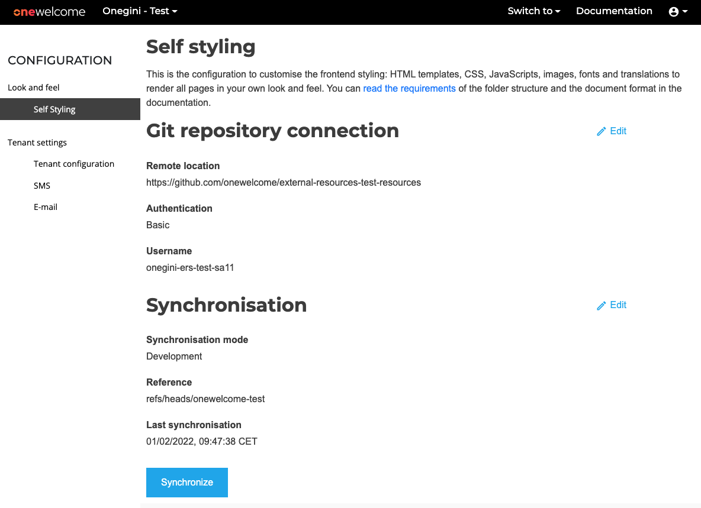
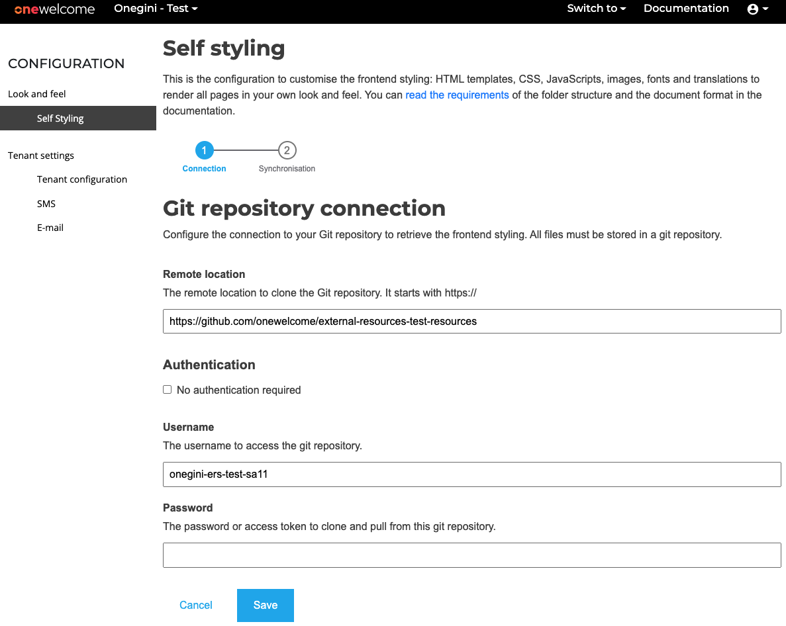
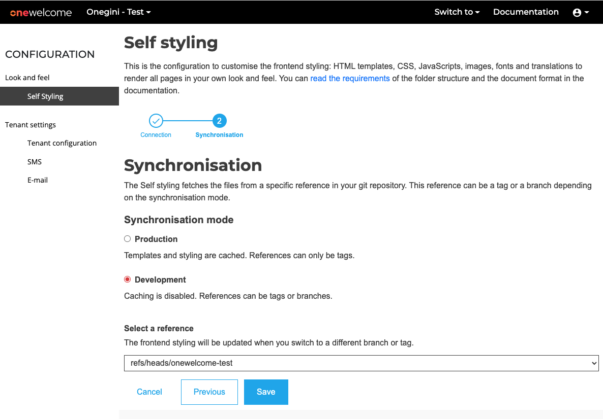

## How do I upload a template?

### Preparing git repository

When preparing the git repository, please use the proper directory structure.

```
├── cim
    ├── extension-resources    
       ├── email-templates
       ├── messages
       ├── static
       |   ├── css
       |   ├── images
       |   └── js
       └── templates
           └── personal
├── access
    ├── <template-set-name>
        ├── consent.html
        ├── error.html
        ├── ...
    ├── default
        ├── consent.html
        ├── error.html
        ├── ...
    ├── messages
├── delegation
    ├── locales
        ├── <locale code>
            ├── translation.json
    ├── logo.png
    ├── palette.json
    ├── favicon.ico
```        

#### CIM

The `cim` directory contains templates and messages for login and sign up. Within the `extension-resources` folder, you can add any of the
following folders:

- Email templates: templates for emails.
- Messages: key-value messages in multiple languages.
- Static: js and CSS, images, and other static resources.
- Templates: templates displayed in the frontend.

#### Access

The `access` directory contains template sets used to change your web applications and mobile clients' look and feel. Refer to
the [Access component documentation](../products/access/topics/look-and-feel/index.md) to learn more about switching the template set per
client and the contents of a particular template set. The name of the directory is resolved as the name of the specific template set. If the
template cannot be found in the chosen set's directory, the content will be served from the `default` directory.
The `messages` subdirectory contains message bundles that the Access Engine application will load. Please note that there is one folder
for `messages` that are used by all template sets.

#### Delegation

The `delegation` directory contains resources that allow customizing the web experience
in [Delegated Administration for Business Partners (DABP)](../dabp/index.md). You can customize the following resources:

- Translations: key-value messages in multiple languages. Please refer to [the example](translation.json)
- Logo: use `logo.png` file
- Favicon: use `favicon.ico` file
- Application theme: use `palette.json` file, [more information available here](https://material-ui.com/customization/theming/)

### Create git repository connection

1. Log into **OneWelcome Console**
2. Select tenant for which you want to configure styling. This step is optional if only single tenant is available for logged-in user.
3. Using top navigation `Switch to` option select `Configuration`, and then `Self styling` from side menu.
4. The window *Self styling* opens: <br><br>
   
5. Click `Edit` on the right of `Git repository connection` and fill the connection details <br><br>
   

       | Field                          | Description
       |--------------------------------|------------
       | **Remote location**            | The remote location to clone the Git Repository. It must start with `https://`. `ssh` is not supported. 
       | **No authentication required** | Enable this option when your GIT repository is publicly accessible. This option is disabled by default which means that the Git Repository is private and protected by a username and password.
       | **Username**                   | The username for the git repository.
       | **Password**                   | The password for the git repository. Instead of using a password, you can generate a GitHub personal access token here: [Personal access tokens](https://github.com/settings/tokens).

6. Click \[Save\]. (*The form has been validated and stored.*)

### Select reference

1. After completing the steps under [Create Git repository connection](#create-git-repository-connection), the *synchronisation* window
   opens: <br> <br>
   

       | Field                          | Description
       |--------------------------------|------------
       | **Synchronisation mode**       | Allows selecting synchronisation mode. Development mode allows selecting branches and tags from the configured repository, but does not cache the data. Production mode allows selecting tags only, but caching is enabled.
       | **Reference**                  | Branch or tag from which templates will be fetched

2. When the correct tag or branch is selected, click \[Save\].
   *The branch or tag is stored, and synchronisation will happen automatically*.
3. After saving, the overview page is displayed:


The overview page shows the following information:

| Field                    | Description                                                                          |
|--------------------------|--------------------------------------------------------------------------------------|
| **Remote location**      | The remote URL of the GIT repository.                                                |
| **Authentication**       | The authentication method to access the GIT repository, for example, 'basic'.        |
| **Username**             | The username, only required if the authentication method is "Username and password". |
| **Synchronisation mode** | Selected synchronisation mode.                                                       |
| **Reference**            | The selected branch or tag for the templates and translations.                       |
| **Last synchronisation** | The last time the resources have been fetched from the remote repository.            |

#### Edit connection

To edit the Git repository connection, click \[Edit\] on the right side of `Git repository connection` header on main page.

#### Change reference

To change the reference, click \[Edit\] on the right side of `Synchronisation` header on main page.

### Synchronize

To synchronize a Git Repository, click \[Synchronize\] in the overview page:


- During synchronisation, the external resources (HTML/CSS/images) are fetched from the selected Git repository and stored on the server.
- After synchronisation, the templates are uploaded to your environment. You can now start testing the templates, for example, by loading
  the login page.

!!!important

    Changes in the templates will only be visible on the production environment after clearing the CIM cache (or restarting the application). Please ask your contact within Onegini.
