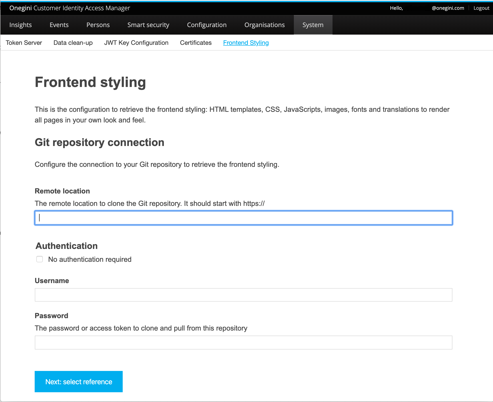
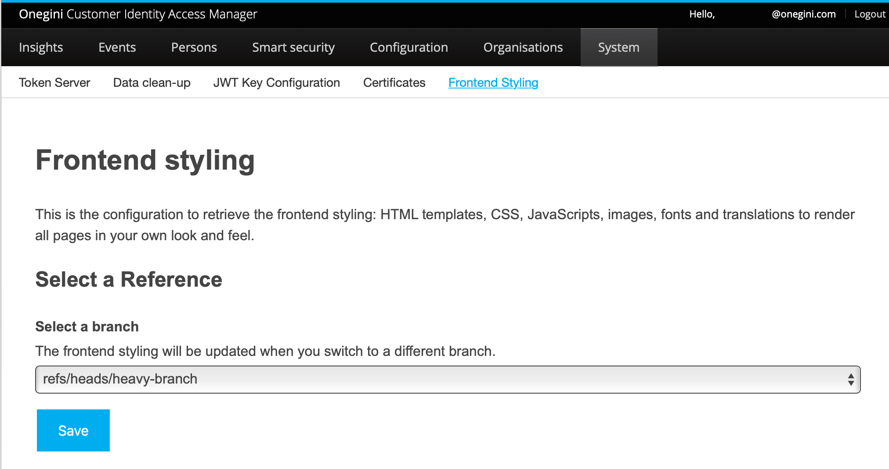

## How do I upload a template? 


###  Preparing git repository
When preparing the git repository, please use the proper directory structure.   

```
├── cim
    ├── extension-resources    
       ├── email-templates
       ├── messages
       ├── static
       |   ├── css
       |   ├── images
       |   └── js
       └── templates
           └── personal
├── access
    ├── <template-set-name>
        ├── 
    ├── default
        ├── 
    ├── messages
├── delegation
    ├── locales
        ├── <locale code>
            ├── translation.json
    ├── logo.png
    ├── palette.json
    ├── favicon.ico
```        

#### CIM
The `cim` directory contains login templates and messages. Within the `extension-resources` folder, you can add any of the following folders:

  - Email templates: templates for emails.
  - Messages: key-value messages in multiple languages.
  - Static: js and CSS, images, and other static resources.
  - Templates: templates displayed in the frontend.

#### Access
The `access` directory contains template sets used to change your web applications and mobile clients' look and feel. Refer to the [Access component documentation](./products/access/topics/look-and-feel/index.md) to learn more about switching the template set per client and the contents of a particular template set. The name of the directory is resolved as the name of the specific template set. If the template cannot be found in the chosen set's directory, the content will be served from the `default` directory.
The `messages` subdirectory contains message bundles that the Access Engine application will load. Please note that there is one folder for `messages` that are used by all template sets.  

#### Delegation
The `delegation` directory contains resources that allow customizing the web experience in [Delegated Administration for Business Partners (DABP)](./dabp/index.md). You can customize the following resources:

  - Translations: key-value messages in multiple languages. Please refer to [the example](translation.json)
  - Logo: use `logo.png` file
  - Favicon: use `favicon.ico` file
  - Application theme: use `palette.json` file, [more information available here](https://material-ui.com/customization/theming/)

### Create git repository connection
1. Log into **Onegini Customer Identity Access Manager** >`System` > `Frontend styling`.
2. The window *Frontend styling* opens: <br><br>

1. Fill in the following fields:

    | Field|Description   |
    |---|---|
    |  **Remote location** | Define the remote location to clone the Git Repository. Only https:// is supported.   | 
    |  **No authentication required** | If this option is enabled, username and password are not mandatory, and the Git Repository will be public. This option is disabled by default which means that the Git Repository is private and protected by a username and password.
    |**Username**| The username for the git repository.|
    |**Password**| The password for the git repository. Instead of using a password, you can generate a GitHub personal access token here: [Personal access tokens](https://github.com/settings/tokens). |

2. Click [Next: select reference]. (*The form has been validated and stored.*) 

### Select reference

1. After completing the steps under [Create Git repository connection](#create-git-repository-connection), the *Select a Reference*-window opens: <br> <br>


6. In the 'Select a branch' or 'Select a tag' field, all the available remote tags (when working in a staging or production environment) and branches (when working in a development or testing environment) can be selected. The first tag or branch in the list will be preselected.
7. When the correct tag or branch is selected, click [Save]. 
   *The branch or tag is stored, and synchronization will happen automatically*.
8. After saving, the overview page is displayed:


The overview page shows the following information:

| Field|Description   |
|---|---|
|  **Clone URL** | The remote URL.| 
|  **Authentication** | The authentication method, for example, 'basic'.|
|**Username**| The username, only required if the authentication method is "Username and password".|
|**Branch or Tag**| The selected branch or tag. |
|**Last checked**| The last time the resources have been fetched from the remote repository.|

#### Edit connection   
To edit the Git repository connection, click [Edit connection]. 

#### Change reference
To change the reference, click [Change reference].

### Synchronize

To synchronize a Git Repository, click [Synchronize] in the overview page:


- During synchronization, the external resources (HTML/CSS/images) are fetched from the selected Git repository and stored on the server. 
- After synchronization, the templates are uploaded to your environment. You can now start testing the templates, for example, by loading the login page.

!!!important 
    Changes in the templates will only be visible on the production environment after clearing the CIM cache (or restarting the application). Please ask your contact within Onegini.

